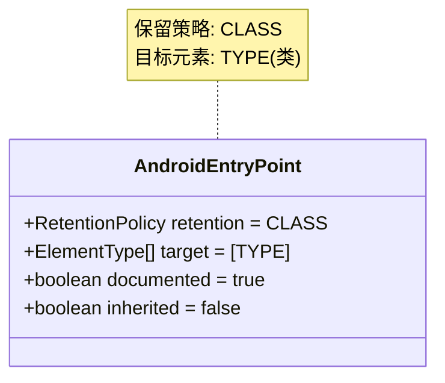
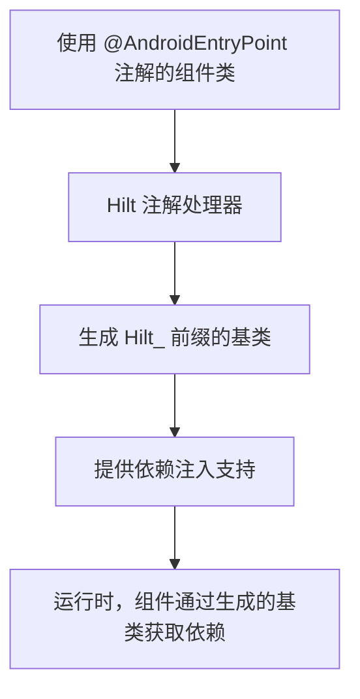
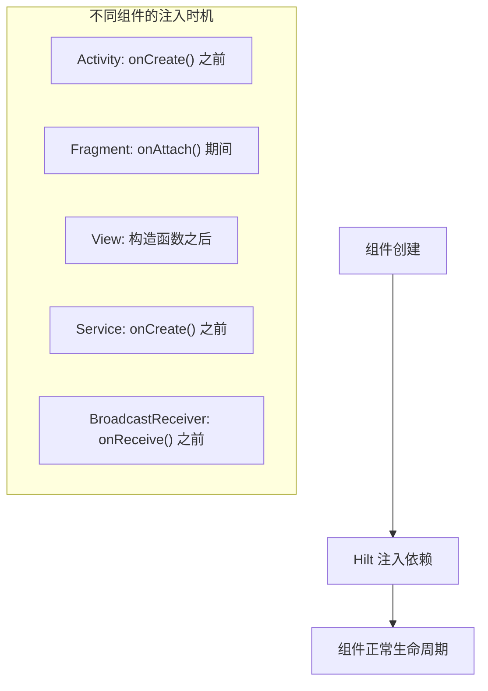
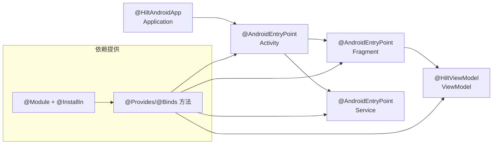
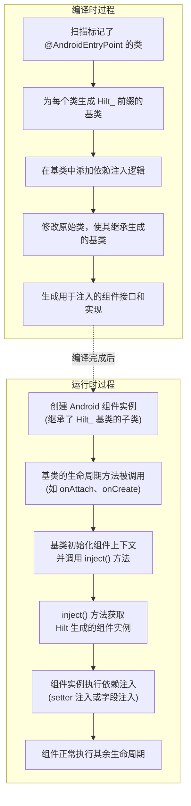

# `@AndroidEntryPoint` 注解详解

## 注解基本信息

- **注解名称**：`dagger.hilt.android.AndroidEntryPoint`
- **所属库/框架**：Dagger Hilt (Google 的 Android 依赖注入框架)
- **注解类型**：编译时注解
- **首次引入版本**：Hilt 1.0.0-alpha01 (2020 年)
- **官方文档链接**：[Hilt AndroidEntryPoint 文档](https://dagger.dev/hilt/android-entry-point)
- **对应概念**：
  - iOS: 类似 SwiftUI 的 `@EnvironmentObject` 或 Swinject 依赖注入容器
  - Flutter: 类似 `GetIt` 或 `Provider` 的依赖注入机制
  - React: 类似 Context API 或 React Hooks 中的依赖注入

## 注解详细解析

### 注解定义

`@AndroidEntryPoint` 注解是 Dagger Hilt 框架的核心注解之一，用于标记 Android 组件类，使其能够接收依赖注入。该注解允许在标记的组件中使用 `@Inject` 注解来注入依赖项。



### 注解工作原理

`@AndroidEntryPoint` 注解在编译时被处理，Hilt 的注解处理器会为每个标记的 Android 组件生成一个 Hilt 组件类，该类负责处理依赖注入。



## 注解使用方式

### 基本语法

`@AndroidEntryPoint` 注解用于标记需要依赖注入的 Android 组件类。使用方式非常简单，只需在类声明前添加注解即可。

```kotlin
// Kotlin 示例
@AndroidEntryPoint
class MainActivity : AppCompatActivity() {
    // 可以使用 @Inject 注入依赖
    @Inject lateinit var navigator: AppNavigator
    
    override fun onCreate(savedInstanceState: Bundle?) {
        super.onCreate(savedInstanceState)
        // navigator 已被自动注入，可以直接使用
    }
}
```

```java
// Java 示例
@AndroidEntryPoint
public class MainActivity extends AppCompatActivity {
    // 可以使用 @Inject 注入依赖
    @Inject Navigator navigator;
    
    @Override
    protected void onCreate(Bundle savedInstanceState) {
        super.onCreate(savedInstanceState);
        // navigator 已被自动注入，可以直接使用
    }
}
```

### 位置用法

`@AndroidEntryPoint` 注解只能应用于以下 Android 组件类型：

- Activity
- Fragment
- View
- Service
- BroadcastReceiver
- Application (更推荐使用 `@HiltAndroidApp`)

每种组件类型的注入时机与 Android 组件的生命周期相关联：



### 常见使用模式

1. **用于 Activity 和 Fragment 注入导航器和视图模型工厂**

```kotlin
@AndroidEntryPoint
class MainActivity : AppCompatActivity() {
    // 注入导航器
    @Inject lateinit var navigator: AppNavigator
    
    // 注入 ViewModel
    private val viewModel: MainViewModel by viewModels()
}
```

2. **用于 Fragment 注入数据源和工具类**

```kotlin
@AndroidEntryPoint
class LogsFragment : Fragment() {
    // 注入数据源
    @Inject lateinit var logger: LoggerDataSource
    
    // 注入工具类
    @Inject lateinit var dateFormatter: DateFormatter
}
```

3. **用于 Service 注入后台处理组件**

```kotlin
@AndroidEntryPoint
class DataSyncService : Service() {
    // 注入网络客户端
    @Inject lateinit var networkClient: NetworkClient
    
    // 注入数据库访问对象
    @Inject lateinit var database: AppDatabase
}
```

### 组合使用

`@AndroidEntryPoint` 通常与以下 Hilt 注解一起使用：

1. **`@HiltViewModel`**：标记 ViewModel 类以支持依赖注入
2. **`@Inject`**：标记需要被注入的字段或构造函数
3. **`@Module` 和 `@InstallIn`**：定义和安装提供依赖的模块
4. **`@Provides` 和 `@Binds`**：在模块中提供或绑定依赖实例

### API 调用关系



### 与其他框架对比

| 框架 | 概念 | 对比 |
|------|------|------|
| iOS Swinject | Container 注册与解析 | Swinject 需要手动注册依赖，而 Hilt 通过注解自动处理 |
| Flutter GetIt | 服务定位器 | GetIt 使用全局访问点，Hilt 使用构造函数注入和字段注入 |
| React Context | Provider 与 Consumer | Context API 需要包装组件，Hilt 直接在类中注入依赖 |
| Spring | @Component, @Autowired | 概念非常相似，但 Hilt 专为 Android 组件设计 |

## 注解效果分析

### 编译前代码

在使用 `@AndroidEntryPoint` 注解之前，如果我们需要在 Android 组件中使用依赖，通常需要手动获取依赖对象或者使用服务定位器模式：

```kotlin
// 未使用 Hilt 的 Fragment
class LogsFragment : Fragment() {
    // 手动获取依赖
    private lateinit var logger: LoggerDataSource
    private lateinit var dateFormatter: DateFormatter
    
    override fun onAttach(context: Context) {
        super.onAttach(context)
        // 手动初始化依赖
        val application = requireActivity().application as LogApplication
        logger = application.serviceLocator.getLoggerDataSource()
        dateFormatter = application.serviceLocator.getDateFormatter()
    }
    
    // 使用依赖
}
```

### 编译后效果

使用 `@AndroidEntryPoint` 注解后，Hilt 会在编译时生成一个带有 `Hilt_` 前缀的基类，原始类会继承这个生成的基类。生成的基类负责处理依赖注入逻辑：

生成的基类示例（简化版）：

```java
// 生成的 Hilt 基类
public abstract class Hilt_LogsFragment extends Fragment implements GeneratedComponentManagerHolder {
    private volatile FragmentComponentManager componentManager;
    private final Object componentManagerLock = new Object();
    private boolean injected = false;

    public Hilt_LogsFragment() {
        super();
    }

    public Hilt_LogsFragment(int contentLayoutId) {
        super(contentLayoutId);
    }

    @Override
    public void onAttach(Context context) {
        super.onAttach(context);
        // 初始化组件上下文
        initializeComponentContext();
        // 执行依赖注入
        inject();
    }

    @NonNull
    protected FragmentComponentManager createComponentManager() {
        return new FragmentComponentManager(this);
    }

    @Override
    public final Object generatedComponent() {
        return componentManager().generatedComponent();
    }

    protected void inject() {
        if (!injected) {
            injected = true;
            // 调用生成的注入方法
            ((LogsFragment_GeneratedInjector) generatedComponent()).injectLogsFragment(UnsafeCasts.unsafeCast(this));
        }
    }
    
    // 其他生命周期和组件管理方法
}
```

原始类在编译后会变为：

```java
// 编译后的原始类（简化版）
@AndroidEntryPoint
public final class LogsFragment extends Hilt_LogsFragment {
    @Inject LoggerDataSource logger;
    @Inject DateFormatter dateFormatter;
    
    // 原始类方法
    // 不需要手动管理依赖，Hilt 会通过生成的基类自动注入依赖
}
```

### 伪代码说明



### 运行时行为

在运行时，`@AndroidEntryPoint` 注解的作用已经转化为继承关系和代码行为：

1. 每个标记的 Android 组件现在都继承自 Hilt 生成的基类
2. 基类在适当的生命周期阶段负责执行依赖注入
3. 基类管理组件的注入状态，确保依赖只被注入一次
4. 基类提供对 Hilt 生成的组件的访问

### 生命周期影响

`@AndroidEntryPoint` 注解会影响各个 Android 组件的生命周期：

- **Activity**: 在 `super.onCreate()` 调用之前注入依赖
- **Fragment**: 在 `onAttach(Context)` 方法中注入依赖
- **View**: 在构造函数之后立即注入依赖
- **Service**: 在 `onCreate()` 方法之前注入依赖
- **BroadcastReceiver**: 在 `onReceive()` 方法之前注入依赖

### 差异对比

**使用前**:

- 手动管理依赖对象的创建和获取
- 需要编写大量样板代码
- 难以进行单元测试（依赖紧耦合）
- 组件间依赖关系不明确

**使用后**:

- 自动注入依赖
- 减少样板代码
- 易于进行单元测试（可轻松模拟依赖）
- 组件间依赖关系清晰可见

## 代码示例

### 基础用法

以下是使用 `@AndroidEntryPoint` 注解的基础用法示例，包含详细解释：

#### 1. 首先配置项目使用 Hilt

在项目级 build.gradle 中添加 Hilt 插件：

```gradle
buildscript {
    dependencies {
        classpath 'com.google.dagger:hilt-android-gradle-plugin:2.44'
    }
}
```

在应用级 build.gradle 中应用 Hilt 插件并添加依赖：

```gradle
plugins {
    id 'com.android.application'
    id 'kotlin-android'
    id 'kotlin-kapt'
    id 'dagger.hilt.android.plugin'
}

dependencies {
    implementation 'com.google.dagger:hilt-android:2.44'
    kapt 'com.google.dagger:hilt-compiler:2.44'
}
```

#### 2. 为 Application 类添加 @HiltAndroidApp 注解

```kotlin
// 此注解会触发 Hilt 的代码生成，包括应用级组件
@HiltAndroidApp
class LogApplication : Application()
```

#### 3. 在 Activity 中使用 @AndroidEntryPoint

```kotlin
@AndroidEntryPoint
class MainActivity : AppCompatActivity() {
    // 使用 @Inject 注入依赖
    @Inject lateinit var navigator: AppNavigator

    override fun onCreate(savedInstanceState: Bundle?) {
        super.onCreate(savedInstanceState)
        setContentView(R.layout.activity_main)
        
        // 在此可以直接使用已注入的依赖
        if (savedInstanceState == null) {
            navigator.navigateTo(Screens.BUTTONS)
        }
    }
}
```

#### 4. 在 Fragment 中使用 @AndroidEntryPoint

```kotlin
@AndroidEntryPoint
class ButtonsFragment : Fragment() {
    // 使用 @Inject 注入依赖
    @Inject lateinit var logger: LoggerDataSource
    @Inject lateinit var navigator: AppNavigator
    
    override fun onCreateView(
        inflater: LayoutInflater,
        container: ViewGroup?,
        savedInstanceState: Bundle?
    ): View? {
        return inflater.inflate(R.layout.fragment_buttons, container, false)
    }
    
    override fun onViewCreated(view: View, savedInstanceState: Bundle?) {
        super.onViewCreated(view, savedInstanceState)
        
        // 在此可以直接使用已注入的依赖
        view.findViewById<Button>(R.id.button1).setOnClickListener {
            logger.addLog("Button 1 clicked")
            navigator.navigateTo(Screens.LOGS)
        }
    }
}
```

### 进阶用法

#### 1. 与 ViewModel 结合使用

在 ViewModel 中:

```kotlin
// 使用 @HiltViewModel 而不是 @AndroidEntryPoint
@HiltViewModel
class LogsViewModel @Inject constructor(
    private val loggerDataSource: LoggerDataSource,
    private val dateFormatter: DateFormatter
) : ViewModel() {
    
    val logs = loggerDataSource.getAllLogs()
    
    fun formatDate(date: Date): String {
        return dateFormatter.formatDate(date)
    }
}
```

在 Fragment 中:

```kotlin
@AndroidEntryPoint
class LogsFragment : Fragment() {
    // 使用 by viewModels() 委托获取 ViewModel 实例
    private val viewModel: LogsViewModel by viewModels()
    
    override fun onViewCreated(view: View, savedInstanceState: Bundle?) {
        super.onViewCreated(view, savedInstanceState)
        
        // 观察 ViewModel 中的数据
        viewModel.logs.observe(viewLifecycleOwner) { logs ->
            // 更新 UI
        }
    }
}
```

#### 2. 结合 Module 提供依赖

定义模块:

```kotlin
@Module
@InstallIn(SingletonComponent::class)
object DatabaseModule {
    
    @Provides
    @Singleton
    fun provideDatabase(@ApplicationContext context: Context): AppDatabase {
        return Room.databaseBuilder(
            context,
            AppDatabase::class.java,
            "logging.db"
        ).build()
    }
    
    @Provides
    @Singleton
    fun provideLogDao(database: AppDatabase): LogDao {
        return database.logDao()
    }
}
```

定义接口和实现:

```kotlin
// 接口
interface LoggerDataSource {
    fun addLog(msg: String)
    fun getAllLogs(): LiveData<List<Log>>
    fun removeLogs()
}

// 实现
// 使用 @Inject 构造函数
class DatabaseLoggerDataSource @Inject constructor(
    private val logDao: LogDao
) : LoggerDataSource {
    override fun addLog(msg: String) {
        // 实现
    }
    
    override fun getAllLogs(): LiveData<List<Log>> {
        // 实现
    }
    
    override fun removeLogs() {
        // 实现
    }
}
```

绑定实现到接口:

```kotlin
@Module
@InstallIn(SingletonComponent::class)
abstract class LoggingModule {
    
    @Binds
    @Singleton
    abstract fun bindDatabaseLogger(impl: DatabaseLoggerDataSource): LoggerDataSource
}
```

### 常见错误

使用 `@AndroidEntryPoint` 时可能遇到的常见错误：

1. **未添加 @HiltAndroidApp**：

   ```
   错误：Hilt Gradle插件要求所有使用 @AndroidEntryPoint 的 Android 类型都有一个带有 @HiltAndroidApp 注解的应用程序类
   ```

   解决：确保应用程序类添加了 `@HiltAndroidApp` 注解

2. **在不支持的类型上使用 @AndroidEntryPoint**：

   ```
   错误：@AndroidEntryPoint 仅支持 Activity, Fragment, View, Service 和 BroadcastReceiver 类型
   ```

   解决：仅在支持的 Android 组件上使用该注解

3. **依赖注入失败**：

   ```
   错误：无法找到绑定 xxx 类型的绑定
   ```

   解决：确保正确设置了 Module 并提供了所需依赖

4. **类型不匹配**：

   ```
   错误：xxx 的类型与请求的类型不匹配
   ```

   解决：检查依赖提供方法的返回类型与注入位置的类型是否匹配

### 跨平台实现对比

#### iOS (Swift) 等效实现

使用 Swinject 依赖注入框架：

```swift
// 注册依赖
let container = Container()
container.register(NavigatorProtocol.self) { _ in 
    AppNavigator() 
}.inObjectScope(.container)

// 在 ViewController 中使用
class MainViewController: UIViewController {
    var navigator: NavigatorProtocol!
    
    override func viewDidLoad() {
        super.viewDidLoad()
        // 手动解析依赖
        navigator = AppDelegate.container.resolve(NavigatorProtocol.self)!
    }
}
```

#### Flutter 等效实现

使用 GetIt 服务定位器：

```dart
// 注册依赖
final getIt = GetIt.instance;

void setupDependencies() {
  getIt.registerSingleton<AppNavigator>(AppNavigator());
  getIt.registerSingleton<LoggerDataSource>(DatabaseLoggerDataSource());
}

// 在 Widget 中使用
class HomePage extends StatefulWidget {
  @override
  _HomePageState createState() => _HomePageState();
}

class _HomePageState extends State<HomePage> {
  // 通过服务定位器获取依赖
  final navigator = getIt<AppNavigator>();
  
  @override
  Widget build(BuildContext context) {
    // 使用依赖
    return Scaffold(
      body: ElevatedButton(
        onPressed: () => navigator.navigateTo(Screen.logs),
        child: Text('Show Logs'),
      ),
    );
  }
}
```

## 性能与安全考虑

### 编译时开销

`@AndroidEntryPoint` 注解会增加项目的编译时间，因为 Hilt 的注解处理器需要：

1. 扫描所有标记的类
2. 为每个类生成额外的代码
3. 生成依赖注入图

在大型项目中，这可能导致编译时间显著增加。为了减轻这种影响：

- 使用增量编译
- 考虑在开发过程中使用更快的编译方式，如 Kotlin KSP 而不是 KAPT
- 避免不必要的组件继承层次结构

### 运行时开销

`@AndroidEntryPoint` 本身是编译时注解，因此不会直接导致运行时开销。但是，与之相关的 Hilt 依赖注入系统在首次创建依赖图时可能会有一些性能开销。由于以下原因，这种开销通常很小：

1. 大部分工作在编译时完成
2. 依赖图只需构建一次
3. 依赖图的热路径经过优化

### ProGuard 配置

当使用 `@AndroidEntryPoint` 和 Hilt 时，需要确保 ProGuard 不会移除依赖注入所需的类。Hilt 库已包含必要的 ProGuard 规则，但在使用自定义注入时，可能需要添加额外规则：

```proguard
# Hilt 使用的类保持
-keepclasseswithmembers class * {
    @dagger.hilt.* <fields>;
}
-keepclasseswithmembers class * {
    @dagger.hilt.* <methods>;
}

# 保持生成的注入器
-keep class * extends dagger.hilt.android.internal.managers.ViewComponentManager$ViewComponentFactory

# 保持 EntryPoint
-keep @dagger.hilt.EntryPoint class *
```

### 安全最佳实践

使用 `@AndroidEntryPoint` 和 Hilt 时的安全最佳实践：

1. **不要在构造函数中执行关键操作**：因为依赖可能尚未初始化
2. **避免在 `@Inject` 标记的字段初始化前使用**：确保在适当的生命周期阶段访问
3. **使用适当的组件作用域**：避免不必要的单例，减少内存泄漏风险
4. **在测试中提供安全的模拟实现**：特别是对于需要权限的依赖

## 相关注解

### 同类注解

- **`@HiltAndroidApp`**：应用于 Application 类，初始化 Hilt 的核心组件
- **`@EntryPoint`**：为不能直接使用 `@AndroidEntryPoint` 注解的代码提供依赖注入入口点
- **`@HiltViewModel`**：使 ViewModel 类支持 Hilt 依赖注入

### 配套注解

- **`@Inject`**：标记需要注入的构造函数或字段
- **`@Module`**：标记提供依赖的类
- **`@InstallIn`**：指定模块安装到的组件
- **`@Provides`**：标记提供依赖实例的方法
- **`@Binds`**：标记将实现绑定到接口的方法
- **`@Qualifier`**：区分同一类型的不同实现

### 注解比较表

| 注解 | 用途 | 使用位置 | 作用域 |
|------|------|----------|--------|
| @AndroidEntryPoint | 启用组件依赖注入 | Android 组件类 | 组件级 |
| @HiltAndroidApp | 启用应用级依赖注入 | Application 类 | 应用级 |
| @HiltViewModel | 启用 ViewModel 依赖注入 | ViewModel 类 | ViewModel |
| @EntryPoint | 为非 @AndroidEntryPoint 类提供注入 | 接口 | 自定义 |
| @Module | 标记依赖提供者模块 | 类 | 声明式 |
| @InstallIn | 指定模块安装位置 | 模块类 | 组件级 |

## 参考资料

- [Hilt 官方文档](https://dagger.dev/hilt/)
- [Android 开发者 Hilt 指南](https://developer.android.com/training/dependency-injection/hilt-android)
- [Hilt GitHub 仓库](https://github.com/google/dagger)
- [Dagger 依赖注入设计文档](https://dagger.dev/dev-guide/)
- [Kotlin 与 Hilt 最佳实践](https://developer.android.com/codelabs/android-hilt)
- [Hilt 测试指南](https://developer.android.com/training/dependency-injection/hilt-testing)
