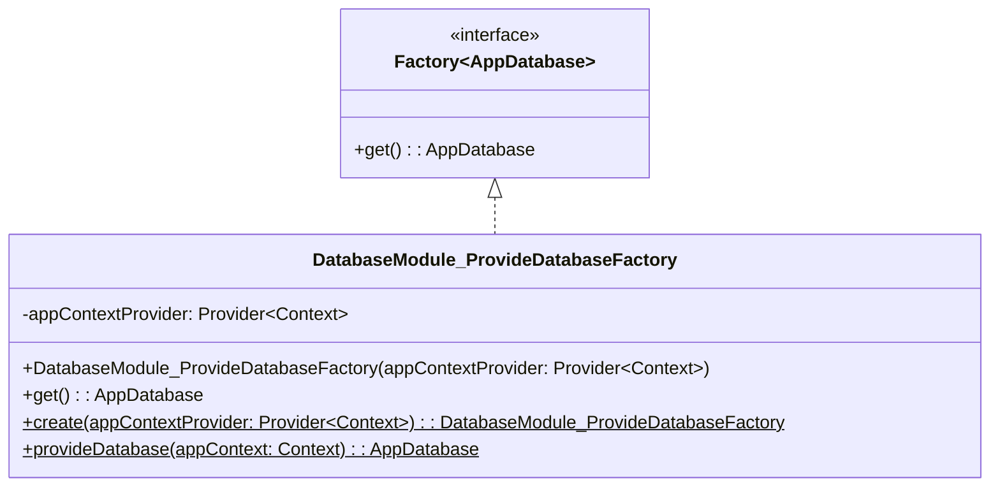
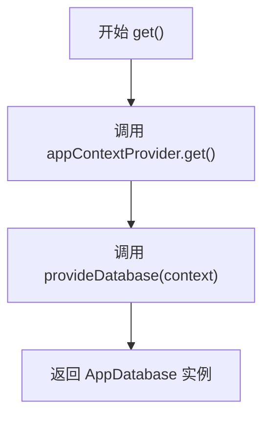
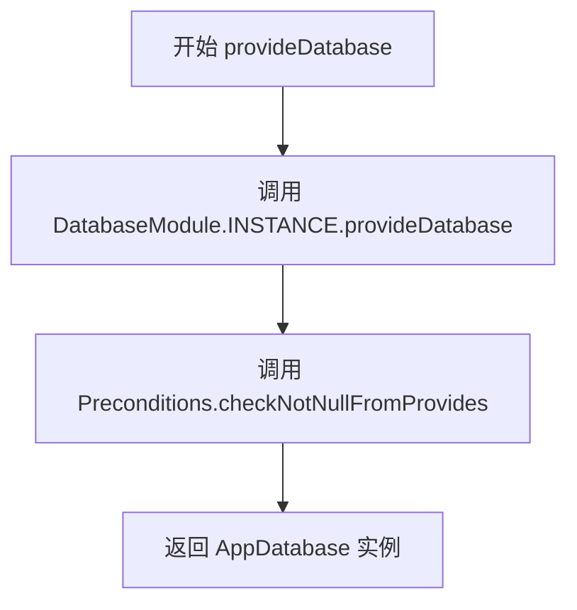

# DatabaseModule_ProvideDatabaseFactory.java 文件分析报告

## 文件基本信息

- **文件名称**：DatabaseModule_ProvideDatabaseFactory.java
- **文件路径**：app/build/generated/source/kapt/debug/com/example/android/hilt/di/DatabaseModule_ProvideDatabaseFactory.java
- **主要功能**：为 Hilt 依赖注入框架生成的工厂类，用于提供 AppDatabase 实例
- **技术要点**：
  - Dagger/Hilt 依赖注入
  - 工厂模式
  - Java 泛型
  - 注解处理器生成的代码
- **Android 基础概念**：
  - 依赖注入（Dependency Injection）
  - Android Context
  - Room 数据库
- **与已知技术栈对比**：
  - iOS：类似于 Swinject 的依赖注入容器
  - Flutter：类似于 GetIt 或 Provider 的依赖注入
  - Spring：类似于 @Component 和 @Bean 的依赖注入机制

## 语法元素分析

### 语法元素概览

- **包声明**：com.example.android.hilt.di
- **导入声明**：
  - android.content.Context
  - com.example.android.hilt.data.AppDatabase
  - dagger.internal.DaggerGenerated
  - dagger.internal.Factory
  - dagger.internal.Preconditions
  - javax.inject.Provider

| 元素类型 | 数量 | 备注 |
|---------|------|------|
| 类      | 1    | 包括一个生成的工厂类 |
| 接口    | 1    | 实现 Factory<AppDatabase> 接口 |
| 枚举    | 0    | 无 |
| 方法    | 4    | 包括构造方法、get、create 和 provideDatabase |
| 属性    | 1    | appContextProvider 字段 |

### 类与接口分析

#### DatabaseModule_ProvideDatabaseFactory 类分析

- **类名**：DatabaseModule_ProvideDatabaseFactory
- **类型**：最终类（final class）
- **职责描述**：作为 Hilt 依赖注入系统的工厂类，负责创建和提供 AppDatabase 实例
- **Java 语法特点**：
  - final 类声明（防止继承）
  - 泛型接口实现
  - 注解使用
  - 静态工厂方法
- **与 Kotlin 对比**：
  - Java 的 final class 对应 Kotlin 的 class（默认 final）
  - Java 的泛型与 Kotlin 的泛型语法略有不同
  - Java 的静态方法在 Kotlin 中通过 companion object 实现
- **与其他语言对比**：
  - Swift：final class 与 Swift 的 final class 概念相同
  - Dart：类似于 Dart 的 factory 构造函数

**属性分析**：

| 属性名 | 类型 | 可见性 | 用途 |
|--------|------|--------|------|
| appContextProvider | Provider<Context> | private final | 提供 Android Context 的提供者实例 |

**方法分析**：

| 方法名 | 参数 | 返回类型 | 用途 |
|--------|------|----------|------|
| DatabaseModule_ProvideDatabaseFactory | Provider<Context> | void | 构造函数，初始化工厂实例 |
| get | 无 | AppDatabase | 获取数据库实例 |
| create | Provider<Context> | DatabaseModule_ProvideDatabaseFactory | 静态工厂方法，创建工厂实例 |
| provideDatabase | Context | AppDatabase | 静态方法，提供数据库实例 |

**类 UML 图**：

### 方法分析

#### get() 方法

- **方法职责**：实现 Factory 接口的 get 方法，返回 AppDatabase 实例
- **调用关系**：调用 provideDatabase 静态方法
- **复杂度分析**：O(1) 时间复杂度

#### provideDatabase(Context) 方法

- **方法职责**：创建并返回 AppDatabase 实例
- **参数分析**：需要 Android Context 实例
- **返回值分析**：非空的 AppDatabase 实例
- **边界条件**：如果返回 null 会抛出异常

### Android 组件分析

本文件主要涉及 Android 依赖注入框架，与以下 Android 概念相关：

- **Context**：Android 应用程序的上下文，提供对应用程序级资源和类的访问
- **Room 数据库**：Android 官方 ORM 框架
- **Hilt**：Android 官方依赖注入框架

### Java 语法分析

#### 使用的 Java 特性

1. **注解**：
   - @DaggerGenerated
   - @SuppressWarnings

2. **泛型**：
   - Factory<AppDatabase>
   - Provider<Context>

3. **接口实现**：
   - implements Factory<AppDatabase>

4. **静态方法**：
   - create()
   - provideDatabase()

### API 使用分析

**重要 API**：

| API 名称 | 用途 | 文档链接 | 类似 iOS/Flutter API |
|----------|------|----------|---------------------|
| dagger.internal.Factory | 依赖注入工厂接口 | [Dagger](mdc:https:/dagger.dev) | Swinject.Factory |
| javax.inject.Provider | 依赖提供者接口 | [JSR 330](mdc:https:/javax.inject) | Provider<T> |
| android.content.Context | Android 上下文 | [Android](mdc:https:/developer.android.com) | UIApplication |

### 注意事项与最佳实践

#### 优点

1. 遵循工厂模式设计模式
2. 使用依赖注入提高代码可测试性
3. 使用 final 类防止继承
4. 使用 Provider 模式实现懒加载

#### 改进空间

1. 考虑使用 Kotlin 重写以获得更简洁的语法
2. 可以添加更多的参数验证

#### 初学者指南

1. 学习 Dagger/Hilt 依赖注入框架基础
2. 理解工厂模式设计模式
3. 掌握 Java 泛型和注解基础

#### 跨平台开发考虑

1. iOS：可以使用 Swinject 实现类似功能
2. Flutter：可以使用 GetIt 或 Provider 实现类似功能
3. React Native：可以使用 TypeDI 实现类似功能
