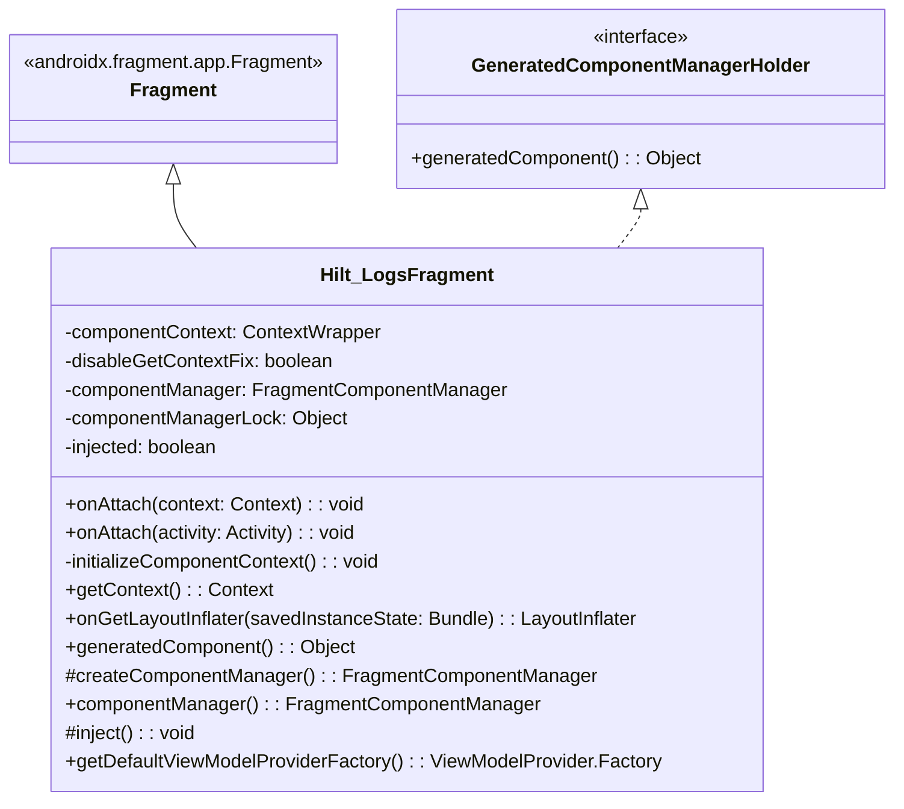
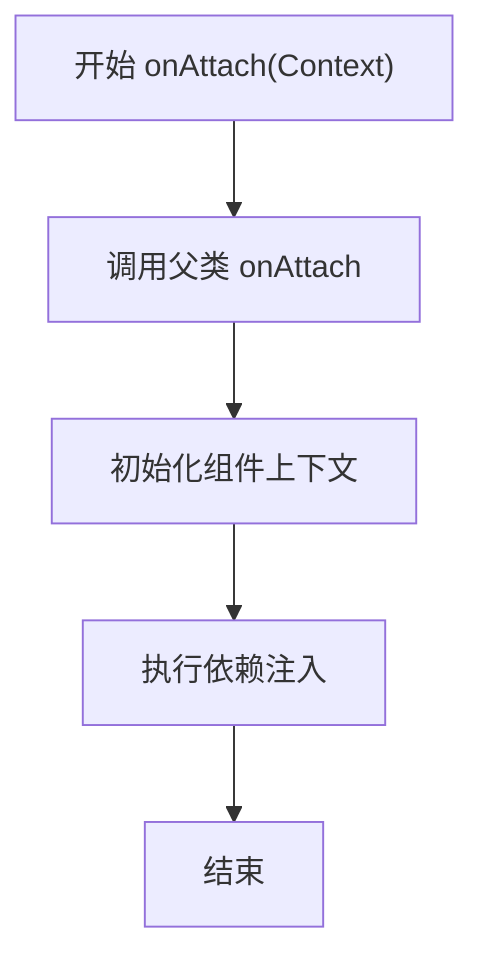
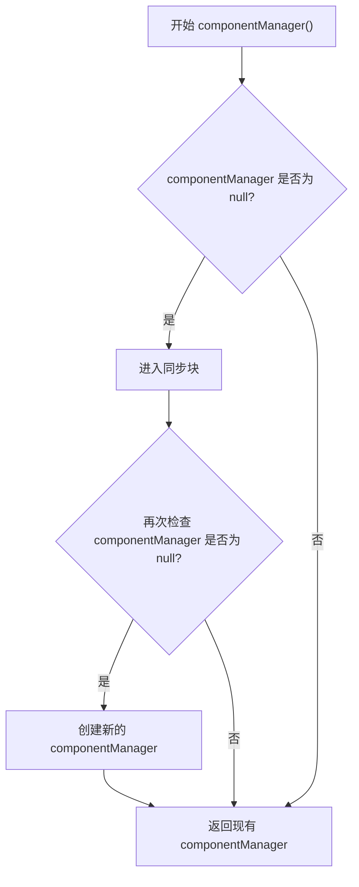

# Hilt_LogsFragment.java 文件分析报告

## 文件基本信息

- **文件名称**：Hilt_LogsFragment.java
- **文件路径**：app/build/generated/source/kapt/debug/com/example/android/hilt/ui/Hilt_LogsFragment.java
- **主要功能**：Hilt 依赖注入框架生成的 Fragment 基类，用于支持 LogsFragment 的依赖注入功能
- **技术要点**：
  - Dagger/Hilt 依赖注入
  - Android Fragment 生命周期管理
  - 组件管理
  - 线程安全
- **Android 基础概念**：
  - Fragment 组件
  - Context 上下文
  - LayoutInflater
  - ViewModelProvider
- **与已知技术栈对比**：
  - iOS：类似于 UIViewController 的生命周期管理
  - Flutter：类似于 StatefulWidget 的状态管理
  - React：类似于 React 组件的生命周期方法

## 语法元素分析

### 语法元素概览

- **包声明**：com.example.android.hilt.ui
- **导入声明**：
  - android.app.Activity
  - android.content.Context
  - android.content.ContextWrapper
  - android.os.Bundle
  - android.view.LayoutInflater
  - androidx.annotation.*
  - androidx.fragment.app.Fragment
  - androidx.lifecycle.ViewModelProvider
  - dagger.hilt.*

| 元素类型 | 数量 | 备注 |
|---------|------|------|
| 类      | 1    | 包括一个抽象基类 |
| 接口    | 1    | 实现 GeneratedComponentManagerHolder 接口 |
| 枚举    | 0    | 无 |
| 方法    | 10   | 包括生命周期方法、组件管理方法等 |
| 属性    | 5    | 包括组件上下文、状态标志等 |

### 类与接口分析

#### Hilt_LogsFragment 类分析

- **类名**：Hilt_LogsFragment
- **类型**：抽象类（abstract class）
- **职责描述**：作为 Hilt 生成的基类，为 LogsFragment 提供依赖注入支持
- **Java 语法特点**：
  - abstract 类声明
  - 接口实现
  - 注解使用
  - 同步块
  - volatile 关键字
- **与 Kotlin 对比**：
  - Java 的 abstract class 对应 Kotlin 的 abstract class
  - Java 的 volatile 在 Kotlin 中使用 @Volatile 注解
  - Java 的同步块在 Kotlin 中使用 synchronized 函数
- **与其他语言对比**：
  - Swift：类似于 Swift 的 class 继承
  - Dart：类似于 Dart 的抽象类

**属性分析**：

| 属性名 | 类型 | 可见性 | 用途 |
|--------|------|--------|------|
| componentContext | ContextWrapper | private | 存储组件上下文包装器 |
| disableGetContextFix | boolean | private | 控制是否禁用 Context 获取修复 |
| componentManager | FragmentComponentManager | private volatile | 管理 Fragment 组件（线程安全） |
| componentManagerLock | Object | private final | 用于同步的锁对象 |
| injected | boolean | private | 标记是否已完成注入 |

**方法分析**：

| 方法名 | 参数 | 返回类型 | 用途 |
|--------|------|----------|------|
| Hilt_LogsFragment | 无 | void | 默认构造函数 |
| Hilt_LogsFragment | int contentLayoutId | void | 带布局 ID 的构造函数 |
| onAttach | Context context | void | Fragment 附加到 Context 时的回调 |
| onAttach | Activity activity | void | Fragment 附加到 Activity 时的回调（已废弃） |
| initializeComponentContext | 无 | void | 初始化组件上下文 |
| getContext | 无 | Context | 获取上下文 |
| onGetLayoutInflater | Bundle savedInstanceState | LayoutInflater | 获取布局填充器 |
| generatedComponent | 无 | Object | 获取生成的组件 |
| createComponentManager | 无 | FragmentComponentManager | 创建组件管理器 |
| componentManager | 无 | FragmentComponentManager | 获取组件管理器（线程安全） |
| inject | 无 | void | 执行依赖注入 |
| getDefaultViewModelProviderFactory | 无 | ViewModelProvider.Factory | 获取默认的 ViewModel 工厂 |

**类 UML 图**：

### 方法分析

#### onAttach(Context) 方法

- **方法职责**：处理 Fragment 附加到 Context 时的生命周期回调
- **调用关系**：调用 initializeComponentContext() 和 inject() 方法
- **复杂度分析**：O(1) 时间复杂度

#### componentManager() 方法

- **方法职责**：获取组件管理器实例（双重检查锁定模式）
- **线程安全**：使用 volatile 和 synchronized 确保线程安全
- **复杂度分析**：O(1) 时间复杂度

### Android 组件分析

本文件主要涉及 Android Fragment 组件，与以下 Android 概念相关：

- **Fragment 生命周期**：
  - onAttach：Fragment 与 Context 建立关联
  - 生命周期管理：确保依赖注入在适当时机完成
- **Context 处理**：
  - Context 包装：使用 ContextWrapper 包装原始 Context
  - Context 获取：提供 getContext() 方法的安全实现
- **视图管理**：
  - LayoutInflater：处理视图加载
  - ViewModelProvider：支持 ViewModel 创建

### Java 语法分析

#### 使用的 Java 特性

1. **注解**：
   - @Override
   - @CallSuper
   - @MainThread
   - @SuppressWarnings

2. **并发控制**：
   - volatile 关键字
   - synchronized 同步块
   - 双重检查锁定模式

3. **面向对象特性**：
   - 抽象类
   - 接口实现
   - 方法重写

### API 使用分析

**重要 API**：

| API 名称 | 用途 | 文档链接 | 类似 iOS/Flutter API |
|----------|------|----------|---------------------|
| Fragment | Android UI 组件 | [Android Developers](mdc:https:/developer.android.com/reference/androidx/fragment/app/Fragment) | UIViewController / StatefulWidget |
| ContextWrapper | Context 包装器 | [Android Developers](mdc:https:/developer.android.com/reference/android/content/ContextWrapper) | - |
| ViewModelProvider | ViewModel 提供者 | [Android Developers](mdc:https:/developer.android.com/reference/androidx/lifecycle/ViewModelProvider) | - |

### 注意事项与最佳实践

#### 优点

1. 使用双重检查锁定确保线程安全
2. 合理管理 Fragment 生命周期
3. 优雅处理依赖注入
4. 提供 Context 获取的安全实现

#### 改进空间

1. 考虑使用 Kotlin 重写以获得更简洁的语法
2. 可以添加更多的参数验证和错误处理

#### 初学者指南

1. 学习 Android Fragment 生命周期
2. 理解 Hilt 依赖注入基础
3. 掌握 Java 并发编程基础

#### 跨平台开发考虑

1. iOS：
   - 使用 UIViewController 生命周期方法
   - 使用依赖注入框架如 Swinject
2. Flutter：
   - 使用 StatefulWidget 的生命周期方法
   - 使用 GetIt 或 Provider 进行依赖注入
3. React Native：
   - 使用 React 组件生命周期
   - 使用 Context API 或 Redux 管理状态
