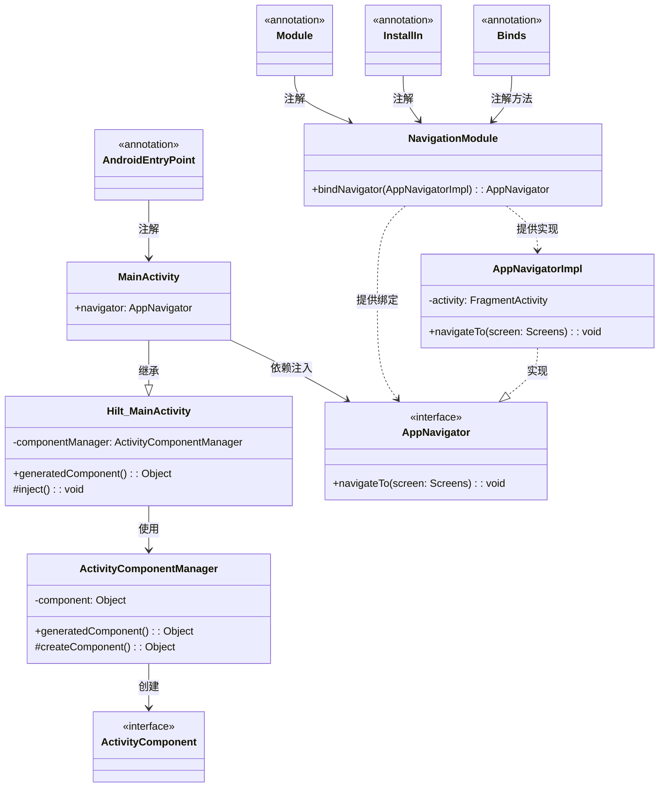
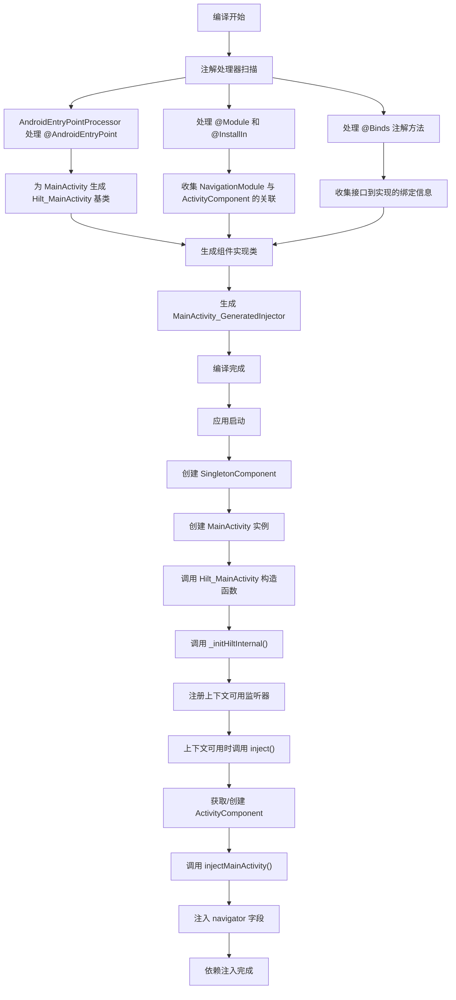
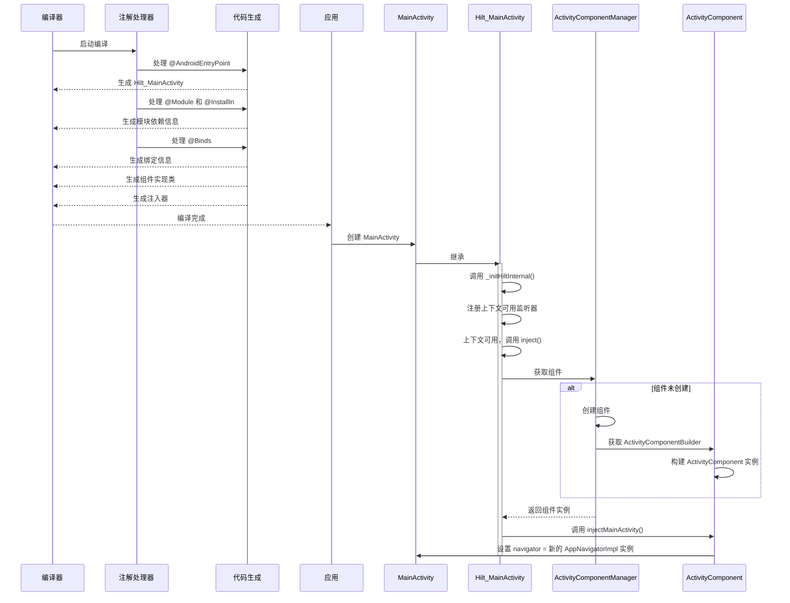

# 简单代码讲解 Hilt 依赖注入库底层实现原理

## 1. 概述

Hilt 是构建在 Dagger 之上的依赖注入库，专为 Android 应用设计。本文将通过示例讲解 Hilt 从编译期到运行时的完整依赖注入过程，以 `navigator` 被注入到 `MainActivity` 为例，深入分析 Hilt 的底层实现原理。

本文基于 Dagger Hilt 2.40.1 版本的源码进行分析。

## 2. 编译期处理流程

### 2.1 注解处理器概述

**Hilt 注解处理器的作用是在编译期间分析源代码中的注解，并生成必要的辅助类，用于在运行时进行依赖注入。这些处理器是 Hilt 实现依赖注入的基础，它们负责构建整个依赖图的代码骨架。**

Hilt 使用注解处理器（APT）在编译时生成代码。主要处理器包括：

- `AndroidEntryPointProcessor`：处理 `@AndroidEntryPoint` 注解
- `AggregatedDepsProcessor`：收集模块信息
- `ComponentProcessor`：生成 Dagger 组件

### 2.2 `@AndroidEntryPoint` 处理流程

**`@AndroidEntryPoint` 处理器的作用是为标记的 Android 组件生成相应的基类，这些基类包含了依赖注入所需的全部基础设施。处理器会根据注解的组件类型生成不同的基类，使得标记的类能够参与 Hilt 的依赖注入系统。**

当 `MainActivity` 被标注为 `@AndroidEntryPoint` 时，编译过程如下：

文件路径：`dagger/java/dagger/hilt/android/processor/internal/androidentrypoint/AndroidEntryPointProcessor.java`

```java
@Override
public void processEach(TypeElement annotation, Element element) throws Exception {
  AndroidEntryPointMetadata metadata = AndroidEntryPointMetadata.of(getProcessingEnv(), element);
  // 生成注入入口点
  new InjectorEntryPointGenerator(getProcessingEnv(), metadata).generate();
  
  switch (metadata.androidType()) {
    case ACTIVITY:
      // 为 Activity 生成基类
      new ActivityGenerator(getProcessingEnv(), metadata).generate();
      break;
    // 其他类型...
  }
}
```

### 2.3 ActivityGenerator 生成基类

**ActivityGenerator 的主要职责是生成一个带有 Hilt_ 前缀的基类，例如 `Hilt_MainActivity`。这个基类是连接用户代码与 Hilt 依赖注入系统的桥梁，它提供了组件管理、依赖获取和注入时机的控制。生成的基类实现了所有必要的生命周期钩子和注入逻辑，使得继承它的类能够自动获得依赖注入功能。**

文件路径：`dagger/java/dagger/hilt/android/processor/internal/androidentrypoint/ActivityGenerator.java`

```java
public void generate() throws IOException {
  TypeSpec.Builder builder =
      TypeSpec.classBuilder(generatedClassName.simpleName())  // Hilt_MainActivity
      .addOriginatingElement(metadata.element())
      .superclass(metadata.baseClassName())  // AppCompatActivity
      .addModifiers(metadata.generatedClassModifiers());

  // 添加构造函数
  Generators.copyConstructors(
      metadata.baseElement(),
      CodeBlock.builder().addStatement("_initHiltInternal()").build(),
      builder);
  
  // 添加初始化方法
  builder.addMethod(init());

  // 添加组件覆盖
  Generators.addComponentOverride(metadata, builder);
  
  // 添加注入方法
  Generators.addInjectionMethods(metadata, builder);
  
  // 生成 Java 文件
  JavaFile.builder(generatedClassName.packageName(), builder.build())
    .build()
    .writeTo(env.getFiler());
}
```

**生成的 `Hilt_MainActivity` 基类是 Hilt 依赖注入过程的核心部分，它包含了组件管理、依赖注入时机的控制以及实际执行注入的逻辑。这个类会作为用户 Activity 的父类，为其提供自动化的依赖注入功能。**

文件路径：`app/build/generated/source/kapt/debug/com/example/android/hilt/ui/Hilt_MainActivity.java`

```java
public abstract class Hilt_MainActivity extends AppCompatActivity implements GeneratedComponentManagerHolder {
  
  private volatile ActivityComponentManager componentManager;
  
  private final Object componentManagerLock = new Object();
  
  private boolean injected = false;
  
  Hilt_MainActivity() {
    super();
    _initHiltInternal();
  }
  
  private void _initHiltInternal() {
    // 注册 Context 可用时的监听器，用于触发注入
    addOnContextAvailableListener(new OnContextAvailableListener() {
      @Override
      public void onContextAvailable(Context context) {
        inject();
      }
    });
  }
  
  @Override
  public final Object generatedComponent() {
    return this.componentManager().generatedComponent();
  }
  
  protected ActivityComponentManager componentManager() {
    if (componentManager == null) {
      synchronized (componentManagerLock) {
        if (componentManager == null) {
          componentManager = new ActivityComponentManager(this);
        }
      }
    }
    return componentManager;
  }
  
  protected void inject() {
    if (!injected) {
      injected = true;
      ((MainActivity_GeneratedInjector) this.generatedComponent())
          .injectMainActivity((MainActivity) this);
    }
  }
}
```

### 2.4 `@Module` 和 `@InstallIn` 的处理

**`@Module` 和 `@InstallIn` 处理器的作用是收集模块信息并关联到特定组件中。这个过程会生成聚合依赖信息类，这些类记录了哪些模块被安装到哪些组件中，为后续组件的生成提供必要的元数据。这些生成的类虽然没有实际代码，但包含了构建依赖图所需的关键信息。**

当处理 `NavigationModule` 时：

```kotlin
@InstallIn(ActivityComponent.class)
@Module
abstract class NavigationModule {
  @Binds
  abstract fun bindNavigator(impl: AppNavigatorImpl): AppNavigator
}
```

处理器生成一个聚合依赖信息，在生成的代码中可以看到：

文件路径：`app/build/generated/source/kapt/debug/hilt_aggregated_deps/_com_example_android_hilt_di_NavigationModule.java`

```java
@AggregatedDeps(
    components = "dagger.hilt.android.components.ActivityComponent",
    modules = "com.example.android.hilt.di.NavigationModule"
)
public class _com_example_android_hilt_di_NavigationModule {
}
```

### 2.5 `@Binds` 处理流程

**`@Binds` 处理器的作用是建立接口与其实现类之间的映射关系。它分析抽象方法的签名，提取返回类型（通常是接口）和参数类型（通常是实现类），然后创建绑定表达式。这些绑定表达式会被整合到依赖图中，在运行时用于确定如何提供接口的实例。**

Dagger 的 `BindingMethodProcessingStep` 处理 `@Binds` 注解，生成一个绑定映射：

```java
// 处理逻辑（简化版）
private void processBinding(ExecutableElement method, BindingMethod bindingMethod) {
  // 验证方法是抽象的
  checkState(method.getModifiers().contains(ABSTRACT));
  
  // 获取返回类型（接口）和参数类型（实现类）
  TypeMirror returnType = method.getReturnType();
  VariableElement parameter = getOnlyElement(method.getParameters());
  TypeMirror parameterType = parameter.asType();
  
  // 生成绑定信息
  contributionBinding = new DelegateBindingExpression(returnType, parameterType);
}
```

## 3. 运行时注入流程

### 3.1 应用启动与组件创建

**运行时注入流程从应用启动开始，Hilt 会按照组件的层次结构依次创建各级组件。当 Activity 创建时，Hilt 会在适当的时机触发依赖注入。整个流程设计保证了依赖注入能够与 Android 生命周期完美集成，确保依赖在使用前已经就绪。**

1. 应用启动，创建 `SingletonComponent`（应用级组件）
2. 当 `MainActivity` 创建时，`Hilt_MainActivity` 的构造函数调用 `_initHiltInternal()`
3. `_initHiltInternal()` 注册上下文可用监听器
4. 当上下文可用时，调用 `inject()` 方法

### 3.2 组件的创建与层次结构

**`ActivityComponentManager` 负责管理 Activity 组件的生命周期和创建过程。它实现了懒加载模式，确保组件只在需要时才被创建，并且每个 Activity 实例有自己独立的组件实例。组件的创建遵循组件层次结构，子组件需要从父组件获取依赖。**

文件路径：`dagger/java/dagger/hilt/android/internal/managers/ActivityComponentManager.java`

```java
@Override
public Object generatedComponent() {
  if (component == null) {
    synchronized (componentLock) {
      if (component == null) {
        component = createComponent();
      }
    }
  }
  return component;
}

protected Object createComponent() {
  // 获取 ActivityRetainedComponent 中的 builder 入口点
  return EntryPoints.get(
      activityRetainedComponentManager, ActivityComponentBuilderEntryPoint.class)
      .activityComponentBuilder()  // 获取构建器
      .activity(activity)  // 设置 activity 实例
      .build();  // 构建组件
}
```

**Hilt 的组件层次结构设计反映了 Android 应用的架构和生命周期特点，每个层级的组件负责不同范围的依赖管理：**

1. `SingletonComponent` (应用级)
2. `ActivityRetainedComponent` (跨 Activity 生命周期)
3. `ActivityComponent` (Activity 级别)

### 3.3 依赖注入过程

**依赖注入的实际执行是通过生成的注入器类完成的。当 Activity 的 `inject()` 方法被调用时，会通过组件获取对应的注入器，然后调用注入方法将依赖实例设置到目标类的字段中。这个过程是完全自动化的，用户无需编写任何注入代码。**

当 `MainActivity` 的 `inject()` 被调用时：

```java
protected void inject() {
  if (!injected) {
    injected = true;
    ((MainActivity_GeneratedInjector) this.generatedComponent())
        .injectMainActivity((MainActivity) this);
  }
}
```

**`MainActivity_MembersInjector` 是实际执行字段注入的类，它包含了将依赖实例分配给目标字段的具体逻辑。注入器通过 Provider 模式获取依赖实例，确保依赖的懒加载和作用域的正确管理。**

文件路径：`app/build/generated/source/kapt/debug/com/example/android/hilt/ui/MainActivity_MembersInjector.java`

```java
public final class MainActivity_MembersInjector implements MembersInjector<MainActivity> {
  private final Provider<AppNavigator> navigatorProvider;

  public MainActivity_MembersInjector(Provider<AppNavigator> navigatorProvider) {
    this.navigatorProvider = navigatorProvider;
  }

  @Override
  public void injectMembers(MainActivity instance) {
    injectNavigator(instance, navigatorProvider.get());
  }

  @InjectedFieldSignature("com.example.android.hilt.ui.MainActivity.navigator")
  public static void injectNavigator(MainActivity instance, AppNavigator navigator) {
    instance.navigator = navigator;
  }
}
```

## 4. 关键注解的底层实现

### 4.1 `@AndroidEntryPoint`

**`@AndroidEntryPoint` 注解是 Hilt 用户 API 的关键入口，它的作用是标记 Android 组件类以参与 Hilt 依赖注入系统。此注解触发了代码生成过程，生成的基类包含了所有必要的依赖注入基础设施，使得目标类能够获得自动化的依赖注入功能。**

文件路径：`dagger/java/dagger/hilt/android/AndroidEntryPoint.java`

```java
@Target({ElementType.TYPE})
@GeneratesRootInput
public @interface AndroidEntryPoint {
  Class<?> value() default Void.class;
}
```

`@AndroidEntryPoint` 实现原理：

1. 触发 `AndroidEntryPointProcessor` 生成 `Hilt_` 前缀的基类
2. 使用 `@GeneratesRootInput` 确保被注解处理器正确处理
3. 生成的基类包含组件管理和注入逻辑

### 4.2 `@Module`

**`@Module` 注解的作用是标记一个类作为依赖提供者的集合。模块类包含了如何创建或提供依赖实例的方法，它们是 Hilt 依赖图的重要组成部分。模块可以按功能或作用域进行组织，通过 includes 和 subcomponents 属性可以构建模块的层次结构。**

文件路径：`dagger/java/dagger/Module.java`

```java
@Documented
@Retention(RetentionPolicy.RUNTIME)
@Target(ElementType.TYPE)
public @interface Module {
  Class<?>[] includes() default {};
  Class<?>[] subcomponents() default {};
}
```

`@Module` 实现原理：

1. 标记类为依赖提供者集合
2. 允许包含其他模块
3. 可以声明子组件

### 4.3 `@InstallIn`

**`@InstallIn` 注解的作用是指定模块应该被安装到哪个 Hilt 组件中。通过这种方式，开发者可以控制依赖的作用域和可见性。这个注解是 Hilt 对 Dagger 的重要扩展，它简化了组件配置，使开发者无需手动构建组件层次结构。**

文件路径：`dagger/java/dagger/hilt/InstallIn.java`

```java
@Retention(CLASS)
@Target({ElementType.TYPE})
@GeneratesRootInput
public @interface InstallIn {
  Class<?>[] value();
}
```

`@InstallIn` 实现原理：

1. 指定模块应安装到哪个组件
2. 使用 `@GeneratesRootInput` 确保处理器收集这些信息
3. 在组件生成时，将模块添加到指定组件

### 4.4 `@Binds`

**`@Binds` 注解的作用是提供接口到实现类的绑定映射。这个注解用在模块类的抽象方法上，方法的返回类型是要绑定的接口，参数是该接口的实现类。这种方式比使用 @Provides 更加简洁高效，因为它不需要创建额外的方法实现。**

文件路径：`dagger/java/dagger/Binds.java`

```java
@Documented
@Retention(RUNTIME)
@Target(METHOD)
public @interface Binds {}
```

`@Binds` 实现原理：

1. 标记抽象方法，用于接口到实现的绑定
2. 不生成实际代码，仅提供关系映射信息
3. 在组件生成时转换为依赖图中的绑定关系

## 5. 组件实现

### 5.1 `ActivityComponent` 接口

**`ActivityComponent` 是 Hilt 预定义的组件接口，它代表着 Activity 作用域的依赖容器。尽管它在声明上是一个空接口，但通过 @DefineComponent 注解，它定义了组件层次结构中的一个重要节点。它的作用是为每个 Activity 实例提供一个独立的依赖容器，管理 Activity 作用域内的依赖实例。**

文件路径：`dagger/java/dagger/hilt/android/components/ActivityComponent.java`

```java
@ActivityScoped
@DefineComponent(parent = ActivityRetainedComponent.class)
public interface ActivityComponent {}
```

`ActivityComponent` 在 Hilt 中只是一个空接口，但它：

1. 使用 `@DefineComponent` 定义组件层次结构
2. 标记作用域为 `@ActivityScoped`
3. 指定父组件为 `ActivityRetainedComponent`

### 5.2 组件生成

**Hilt 在编译期为每个预定义组件生成具体的实现类。这些生成的类包含了创建和提供依赖实例的全部逻辑。对于 ActivityComponent，生成的实现包括 Builder 类和实际的组件实现，前者负责组件的创建过程，后者负责依赖的提供和注入。生成的代码完全基于注解信息，无需开发者手动编写。**

通过分析生成的代码 `DaggerLogApplication_HiltComponents_SingletonC.java`，可以看到 Hilt 为每个 Activity 类型生成特定的组件实现类：

```java
// 简化版，基于生成的代码：ActivityCImpl 和 ActivityCBuilder
private static final class ActivityCBuilder implements LogApplication_HiltComponents.ActivityC.Builder {
  private final DaggerLogApplication_HiltComponents_SingletonC singletonC;
  private final ActivityRetainedCImpl activityRetainedCImpl;
  private Activity activity;
  
  @Override
  public ActivityCBuilder activity(Activity activity) {
    this.activity = Preconditions.checkNotNull(activity);
    return this;
  }
  
  @Override
  public LogApplication_HiltComponents.ActivityC build() {
    Preconditions.checkBuilderRequirement(activity, Activity.class);
    return new ActivityCImpl(singletonC, activityRetainedCImpl, activity);
  }
}

private static final class ActivityCImpl extends LogApplication_HiltComponents.ActivityC {
  private final Activity activity;
  private final DaggerLogApplication_HiltComponents_SingletonC singletonC;
  private final ActivityRetainedCImpl activityRetainedCImpl;
  private final ActivityCImpl activityCImpl = this;
  
  private Provider<FragmentActivity> provideFragmentActivityProvider;
  private Provider<LoggerInMemoryDataSource> loggerInMemoryDataSourceProvider;
  private Provider<LoggerDataSource> bindInMemoryLoggerProvider;
  
  // 实际生成的代码包含的 AppNavigatorImpl 创建逻辑
  private AppNavigatorImpl appNavigatorImpl() {
    return new AppNavigatorImpl((FragmentActivity) activity);
  }
  
  @Override
  public void injectMainActivity(MainActivity mainActivity) {
    injectMainActivity2(mainActivity);
  }
  
  private MainActivity injectMainActivity2(MainActivity instance) {
    MainActivity_MembersInjector.injectNavigator(
        instance, 
        appNavigatorImpl());
    return instance;
  }
}
```

### 5.3 不同 Activity 的组件实例

**每个 Activity 实例拥有自己独立的 ActivityComponent 实例，这是 Hilt 依赖注入系统的重要特征。这种设计确保了不同 Activity 之间的依赖隔离，同时允许依赖与 Activity 的生命周期保持一致。ActivityComponentManager 负责管理这些组件实例，确保它们的正确创建和销毁。**

每个 Activity 实例都有自己的 `ActivityComponent` 实例：

1. 组件类型相同，但是实例不同
2. 不同 Activity 通过 `ActivityComponentManager` 创建各自的组件实例
3. 组件实例的生命周期与 Activity 实例相同

## 6. 整体流程总结

### 6.1 编译期

1. 处理 `@AndroidEntryPoint`，生成 `Hilt_MainActivity` 基类
2. 处理 `@Module` 和 `@InstallIn`，收集模块与组件的关联信息
3. 处理 `@Binds`，收集绑定信息
4. 生成组件接口的实现类和构建器
5. 生成注入器接口和实现

### 6.2 运行时

1. `MainActivity` 继承自生成的 `Hilt_MainActivity` 类
2. 创建 `MainActivity` 实例时，调用 `_initHiltInternal()`
3. Context 可用时，调用 `inject()` 方法
4. `ActivityComponentManager` 创建 `ActivityComponent` 实例
5. 调用组件的 `injectMainActivity()` 方法
6. 为 `MainActivity` 的 `navigator` 字段赋值 `AppNavigatorImpl` 实例

## 7. 类图



## 8. 流程图



## 9. 时序图


