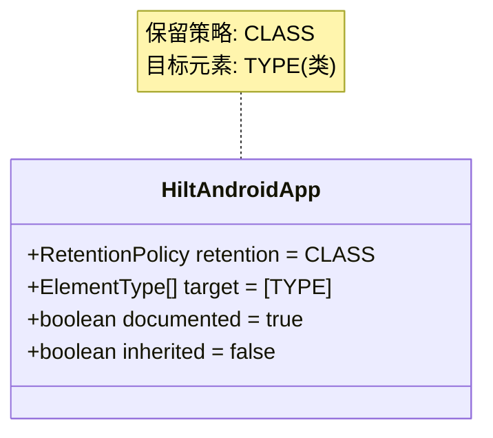
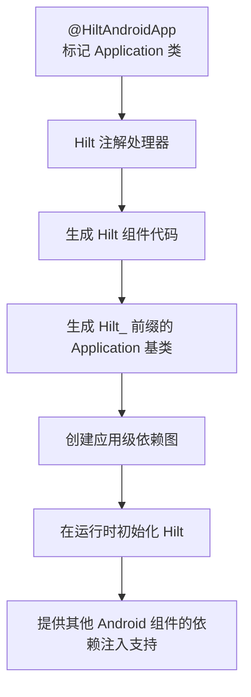
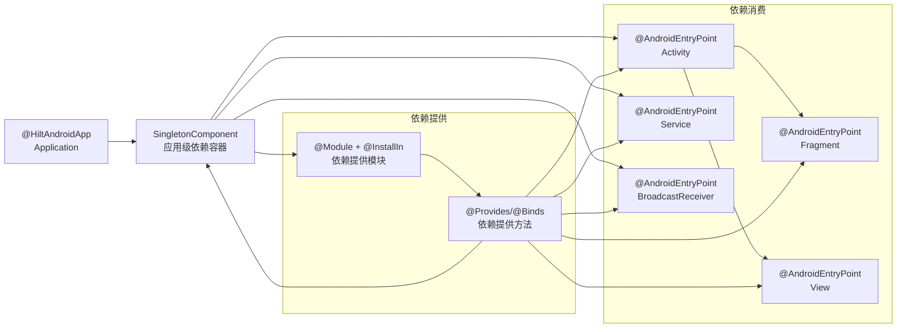
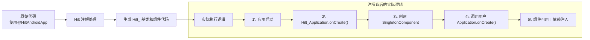
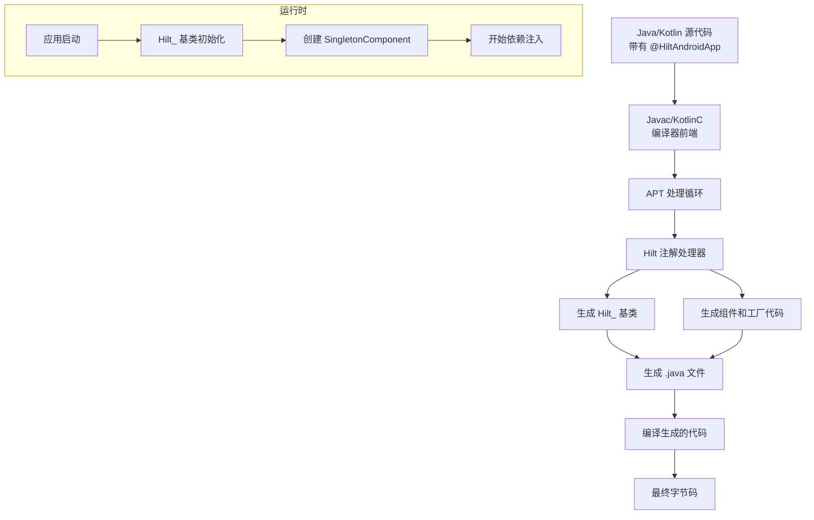
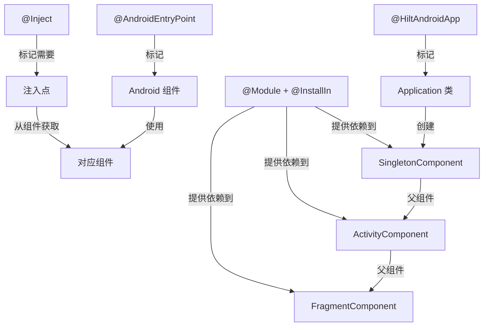

# `@HiltAndroidApp` 注解详解

## 注解基本信息

- **注解名称**：`dagger.hilt.android.HiltAndroidApp`
- **所属库/框架**：Dagger Hilt (Google 的 Android 依赖注入框架)
- **注解类型**：编译时注解
- **首次引入版本**：Hilt 1.0.0-alpha01 (2020 年)
- **官方文档链接**：[Hilt Application 文档](https://dagger.dev/hilt/application)
- **对应概念**：
  - iOS: 类似 Swift 中的 `@UIApplicationMain`，以及 SwiftUI 的 `@main` 属性
  - Flutter: 类似 Flutter 应用初始化过程中的 `main()` 函数和 `runApp()`
  - React: 类似 React 应用程序的根组件和应用初始化配置

## 注解详细解析

### 注解定义

`@HiltAndroidApp` 注解是 Dagger Hilt 框架的核心入口点注解，用于标记 Android 应用程序的 `Application` 类，以触发 Hilt 的代码生成和依赖注入系统的初始化。



### 注解工作原理

`@HiltAndroidApp` 注解在编译时被处理，Hilt 的注解处理器会生成必要的 Dagger 组件和代码，以建立应用程序级别的依赖注入容器。这是 Hilt 框架的入口，所有其他 Hilt 注解（如 `@AndroidEntryPoint`）都依赖于此。



#### 注解处理时机

`@HiltAndroidApp` 注解在**编译期**被处理，具体来说是在 Java/Kotlin 源代码编译成字节码的过程中，通过 APT（Annotation Processing Tool）技术进行处理。这意味着所有的代码生成和依赖图构建在应用程序运行前就已完成。

#### 注解处理器

Hilt 使用 Dagger 的注解处理器架构，专门为 `@HiltAndroidApp` 和其他 Hilt 注解提供了处理器。这些处理器负责：

1. 扫描带有 Hilt 注解的类
2. 验证注解使用的正确性
3. 生成 Dagger 组件和模块代码
4. 生成继承类和辅助类

#### 代码生成

`@HiltAndroidApp` 注解处理后，会生成以下关键代码：

1. 以 `Hilt_` 为前缀的 Application 基类
2. 应用级 Dagger 组件 (`SingletonComponent`)
3. 组件持有者类和工厂类
4. 各种辅助类，用于连接 Hilt 框架和 Android 系统

#### 字节码修改

`@HiltAndroidApp` 本身并不直接修改字节码，而是通过生成新的 Java 源文件来实现功能。这些生成的源文件会被正常编译成字节码。在运行时，应用会使用这些生成的类来执行依赖注入和管理对象图。

与一些使用 ASM 或 ByteBuddy 等库直接修改字节码的框架不同，Hilt 选择使用更安全、更易于调试的源代码生成方式。

## 注解使用方式

### 基本语法

`@HiltAndroidApp` 注解的使用非常简单，只需在 Android 应用程序的 `Application` 类上添加该注解即可：

```kotlin
// Kotlin 示例
@HiltAndroidApp
class MyApplication : Application() {
    // 应用程序代码
}
```

```java
// Java 示例
@HiltAndroidApp
public class MyApplication extends Application {
    // 应用程序代码
}
```

### 位置用法

`@HiltAndroidApp` 注解只能用于 Android 的 `Application` 类上，这是 Hilt 框架的设计要求。具体包括：

- 必须用于继承自 `android.app.Application` 的类
- 一个应用中只能有一个类被标记为 `@HiltAndroidApp`
- 该类必须是应用程序的真实 Application 类（在 AndroidManifest.xml 中配置）

### 常见使用模式

1. **基本用法 - 最小化配置**

```kotlin
@HiltAndroidApp
class MyApplication : Application()
```

这是最常见也是最简单的使用方式，只需要添加注解，不需要任何额外代码。Hilt 将自动处理依赖注入系统的设置。

2. **结合 `onCreate()` 进行初始化**

```kotlin
@HiltAndroidApp
class MyApplication : Application() {
    override fun onCreate() {
        super.onCreate()
        // 执行应用程序级别的初始化
        // 注意：此时 Hilt 已经完成了依赖图的初始化
    }
}
```

3. **添加日志或调试支持**

```kotlin
@HiltAndroidApp
class MyApplication : Application() {
    override fun onCreate() {
        super.onCreate()
        
        if (BuildConfig.DEBUG) {
            // 在调试版本中初始化日志工具
            Timber.plant(Timber.DebugTree())
        }
    }
}
```

### 组合使用

`@HiltAndroidApp` 通常与以下 Hilt 和 Dagger 注解一起使用：

1. **`@AndroidEntryPoint`**：用于标记需要注入依赖的 Android 组件（Activity、Fragment、Service 等）
2. **`@Module` 和 `@InstallIn`**：用于定义提供依赖的模块和指定模块安装位置
3. **`@Inject`**：用于标记需要被注入的字段或构造函数
4. **`@Provides` 和 `@Binds`**：用于在模块中提供或绑定依赖实例

典型的组合使用方式：

```kotlin
// Application 类
@HiltAndroidApp
class MyApplication : Application()

// 在模块中提供依赖
@Module
@InstallIn(SingletonComponent::class)
object AppModule {
    @Provides
    @Singleton
    fun provideDatabase(@ApplicationContext context: Context): AppDatabase {
        return Room.databaseBuilder(
            context,
            AppDatabase::class.java,
            "app_database"
        ).build()
    }
}

// 在 Activity 中注入依赖
@AndroidEntryPoint
class MainActivity : AppCompatActivity() {
    @Inject
    lateinit var database: AppDatabase
}
```

### API 调用关系

`@HiltAndroidApp` 注解在 Hilt 依赖注入系统中扮演核心角色，它与其他组件的关系如下：



### 与其他框架对比

#### iOS 依赖注入框架对比

| iOS 框架 | 初始化方式 | 对比 `@HiltAndroidApp` |
|---------|----------|------------------------|
| Swinject | 手动创建容器并注册依赖 | Swinject 需要更多手动配置，而 `@HiltAndroidApp` 自动设置依赖图 |
| Resolver | 通常在 AppDelegate 中初始化 | Resolver 更轻量级，但缺少 Hilt 的编译时检查 |
| Swift 的 @main | 标记应用入口点 | 概念相似，但 @main 不处理依赖注入 |

Swift 中的类似实现：

```swift
// 使用 Swinject
@UIApplicationMain
class AppDelegate: UIResponder, UIApplicationDelegate {
    let container = Container()
    
    func application(_ application: UIApplication, didFinishLaunchingWithOptions launchOptions: [UIApplication.LaunchOptionsKey: Any]?) -> Bool {
        // 手动注册依赖
        container.register(NetworkService.self) { _ in 
            NetworkServiceImpl() 
        }.inObjectScope(.container)
        
        // 更多注册...
        
        return true
    }
}
```

#### Flutter 依赖注入框架对比

| Flutter 框架 | 初始化方式 | 对比 `@HiltAndroidApp` |
|------------|----------|------------------------|
| GetIt | 通常在 main() 中初始化 | GetIt 是服务定位器模式，而 Hilt 是依赖注入 |
| Provider | 在 widget 树的顶层配置 | Provider 更灵活但没有编译时检查 |
| InheritedWidget | 通过 widget 树传递 | 更复杂的手动实现，而 Hilt 自动化程度高 |

Flutter 中的类似实现：

```dart
// 使用 GetIt
final getIt = GetIt.instance;

void setupDependencies() {
  getIt.registerSingleton<DatabaseService>(DatabaseServiceImpl());
  getIt.registerSingleton<ApiClient>(ApiClientImpl());
}

void main() {
  setupDependencies();
  runApp(MyApp());
}

class MyApp extends StatelessWidget {
  @override
  Widget build(BuildContext context) {
    // 使用注册的依赖
    final db = getIt<DatabaseService>();
    // ...
  }
}
```

## 注解效果分析

### 编译前代码

在没有使用 `@HiltAndroidApp` 注解之前，开发者通常需要手动管理依赖，例如：

```kotlin
// 未使用 Hilt 的 Application 类
class MyApplication : Application() {
    // 手动创建服务定位器或依赖容器
    val serviceLocator = ServiceLocator()
    
    override fun onCreate() {
        super.onCreate()
        
        // 手动初始化依赖
        serviceLocator.initialize(this)
    }
    
    // 服务定位器类
    class ServiceLocator {
        private lateinit var database: AppDatabase
        private lateinit var apiClient: ApiClient
        
        fun initialize(context: Context) {
            database = Room.databaseBuilder(
                context,
                AppDatabase::class.java,
                "app_database"
            ).build()
            
            apiClient = ApiClient(API_URL)
        }
        
        fun getDatabase(): AppDatabase = database
        fun getApiClient(): ApiClient = apiClient
    }
}

// 在组件中使用依赖
class MainActivity : AppCompatActivity() {
    private lateinit var database: AppDatabase
    
    override fun onCreate(savedInstanceState: Bundle?) {
        super.onCreate(savedInstanceState)
        
        // 手动获取依赖
        database = (application as MyApplication)
            .serviceLocator
            .getDatabase()
    }
}
```

### 编译后效果

使用 `@HiltAndroidApp` 注解后，Hilt 会生成大量代码来处理依赖注入。下面是生成代码的简化示例：

```java
// 生成的 Hilt 基类 (简化版)
public abstract class Hilt_MyApplication extends Application implements GeneratedComponentManager<SingletonComponent> {
    private boolean injected = false;
    private SingletonComponent singletonComponent;
    
    @Override
    public final void onCreate() {
        // 在调用用户的 onCreate 前初始化 Hilt
        inject();
        super.onCreate();
    }
    
    private void inject() {
        if (!injected) {
            injected = true;
            // 创建并保存单例组件
            singletonComponent = DaggerMyApplication_HiltComponents_SingletonC.builder()
                .applicationContextModule(new ApplicationContextModule(this))
                .build();
        }
    }
    
    @Override
    public SingletonComponent generatedComponent() {
        return singletonComponent;
    }
}
```

生成的 Dagger 组件代码（简化版）：

```java
@Component(modules = {...})
public interface SingletonComponent {
    // 组件方法和工厂
}

// 工厂和构建器类
public final class DaggerMyApplication_HiltComponents_SingletonC {
    // 构建器和实现
}
```

### 执行逻辑图解



## 代码示例

### 基础用法

以下是使用 `@HiltAndroidApp` 注解的最基本用法：

1. **配置项目**：在项目级和应用级 build.gradle 文件中添加必要的依赖

```gradle
// 项目级 build.gradle
buildscript {
    dependencies {
        classpath 'com.google.dagger:hilt-android-gradle-plugin:2.44'
    }
}

// 应用级 build.gradle
plugins {
    id 'com.android.application'
    id 'kotlin-android'
    id 'kotlin-kapt'
    id 'dagger.hilt.android.plugin'
}

dependencies {
    implementation 'com.google.dagger:hilt-android:2.44'
    kapt 'com.google.dagger:hilt-compiler:2.44'
}
```

2. **创建 Application 类并添加注解**

```kotlin
package com.example.myapp

import android.app.Application
import dagger.hilt.android.HiltAndroidApp

@HiltAndroidApp
class MyApplication : Application()
```

3. **在 AndroidManifest.xml 中注册 Application**

```xml
<manifest xmlns:android="http://schemas.android.com/apk/res/android"
    package="com.example.myapp">
    
    <application
        android:name=".MyApplication"
        android:icon="@mipmap/ic_launcher"
        android:label="@string/app_name"
        android:theme="@style/AppTheme">
        <!-- Activity 声明 -->
    </application>
</manifest>
```

### 进阶用法

下面是一个更完整的示例，展示了 `@HiltAndroidApp` 配合其他 Hilt 注解的使用：

1. **Application 类**

```kotlin
@HiltAndroidApp
class MyApplication : Application() {
    override fun onCreate() {
        super.onCreate()
        // 应用程序初始化逻辑
    }
}
```

2. **定义模块提供依赖**

```kotlin
// 网络模块
@Module
@InstallIn(SingletonComponent::class)
object NetworkModule {
    @Provides
    @Singleton
    fun provideOkHttpClient(): OkHttpClient {
        return OkHttpClient.Builder()
            .connectTimeout(30, TimeUnit.SECONDS)
            .readTimeout(30, TimeUnit.SECONDS)
            .writeTimeout(30, TimeUnit.SECONDS)
            .build()
    }
    
    @Provides
    @Singleton
    fun provideRetrofit(okHttpClient: OkHttpClient): Retrofit {
        return Retrofit.Builder()
            .baseUrl("https://api.example.com/")
            .client(okHttpClient)
            .addConverterFactory(GsonConverterFactory.create())
            .build()
    }
    
    @Provides
    @Singleton
    fun provideApiService(retrofit: Retrofit): ApiService {
        return retrofit.create(ApiService::class.java)
    }
}

// 数据库模块
@Module
@InstallIn(SingletonComponent::class)
object DatabaseModule {
    @Provides
    @Singleton
    fun provideDatabase(@ApplicationContext context: Context): AppDatabase {
        return Room.databaseBuilder(
            context,
            AppDatabase::class.java,
            "app_database"
        ).build()
    }
    
    @Provides
    fun provideUserDao(database: AppDatabase): UserDao {
        return database.userDao()
    }
}
```

3. **使用依赖注入**

```kotlin
@AndroidEntryPoint
class MainActivity : AppCompatActivity() {
    // 注入依赖
    @Inject
    lateinit var apiService: ApiService
    
    @Inject
    lateinit var userDao: UserDao
    
    override fun onCreate(savedInstanceState: Bundle?) {
        super.onCreate(savedInstanceState)
        setContentView(R.layout.activity_main)
        
        // 使用注入的依赖
        apiService.fetchData()
            .enqueue(object : Callback<DataResponse> {
                // 回调实现
            })
    }
}
```

### 常见错误

使用 `@HiltAndroidApp` 时可能遇到的常见错误：

1. **AndroidManifest.xml 中未注册 Application 类**

```
错误：Application类 [com.example.myapp.MyApplication] 在 AndroidManifest.xml 中未注册
```

解决方案：在 AndroidManifest.xml 中正确注册 Application 类

```xml
<application
    android:name=".MyApplication"
    ...>
</application>
```

2. **在非 Application 子类上使用**

```
错误：@HiltAndroidApp 只能用于 android.app.Application 的子类
```

解决方案：确保被注解的类继承自 Application

```kotlin
@HiltAndroidApp
class MyApplication : Application() // 正确
```

3. **多个类使用了 @HiltAndroidApp**

```
错误：发现多个带有 @HiltAndroidApp 的类
```

解决方案：确保项目中只有一个类使用 @HiltAndroidApp 注解

4. **缺少必要的 Gradle 插件或依赖**

```
错误：找不到符号 @HiltAndroidApp
```

解决方案：确保正确配置了 Hilt 的 Gradle 插件和依赖

## 性能与安全考虑

### 编译时开销

`@HiltAndroidApp` 注解会带来以下编译时开销：

1. **增加编译时间**：Hilt 的注解处理器会生成大量代码，这会增加编译时间，尤其是在大型项目中。

2. **增加方法数**：生成的代码会增加应用的方法数，可能导致接近 DEX 方法数限制。

3. **增加构建内存需求**：处理复杂的依赖图需要更多的构建内存。

**优化策略**：

- 使用增量编译
- 在 Kotlin 项目中使用 KSP 而不是 KAPT
- 优化模块结构，避免过度复杂的依赖图

### 运行时开销

`@HiltAndroidApp` 在运行时的开销主要集中在：

1. **应用启动时间**：首次构建依赖图可能会增加应用的启动时间。

2. **内存消耗**：单例依赖会在整个应用生命周期中保持活跃，可能增加内存消耗。

3. **反射使用**：Hilt 在运行时使用一些反射来连接生成的代码和用户代码。

**优化策略**：

- 在性能敏感的情况下延迟初始化一些重量级依赖
- 合理使用作用域，避免过多的单例
- 对频繁创建的对象使用 `@Reusable` 而不是 `@Singleton`

### ProGuard 配置

使用 `@HiltAndroidApp` 和 Hilt 时，需要确保 ProGuard 不会移除或混淆依赖注入所需的类。Hilt 库自带了基本的 ProGuard 规则，但在某些情况下，可能需要添加额外的规则：

```proguard
# 保持 Hilt 生成的类
-keep,allowobfuscation,allowshrinking class dagger.hilt.android.** { *; }
-keep,allowobfuscation,allowshrinking class dagger.hilt.** { *; }
-keep,allowobfuscation,allowshrinking class **_HiltModules { *; }

# 保持使用 @Inject 构造函数的类
-keepclasseswithmembers class * {
    @javax.inject.Inject <init>(...);
}

# 保持被注入的字段
-keepclasseswithmembers class * {
    @javax.inject.Inject <fields>;
}

# 保持标记为 @Module 的类
-keep class * extends dagger.Module
```

### 安全最佳实践

1. **避免在依赖中暴露敏感信息**：不要在注入的对象中存储密码、API 密钥等敏感信息。

2. **注意线程安全**：单例依赖需要考虑线程安全问题，尤其是在多线程环境中。

3. **处理可能的注入空值**：虽然 Hilt 在编译时会检查大多数错误，但仍需要防御性编程。

4. **作用域管理**：对生命周期有限的组件（如 Activity、Fragment）注入的依赖，应使用适当的作用域，避免内存泄漏。

5. **测试替代**：确保依赖可以在测试中被轻松替换为模拟实现。

## 注解实现机制

### APT 实现

`@HiltAndroidApp` 注解处理基于 Java 的注解处理工具（APT）实现。APT 是 Java 编译器的一部分，它可以在编译期处理注解并生成额外的代码。Hilt 使用这一机制来生成依赖注入所需的代码。

注解处理主要阶段：

1. **扫描源码**：APT 查找标记了 `@HiltAndroidApp` 的类
2. **验证注解使用**：检查该类是否为 Application 的子类
3. **生成代码**：生成基类和组件代码
4. **编译生成的代码**：与用户代码一起编译

### 注解处理器注册

Hilt 的注解处理器在 META-INF/services 目录中注册，使编译器能够发现它们：

```
META-INF/services/javax.annotation.processing.Processor
```

该文件内部包含处理器的全限定类名：

```
dagger.hilt.processor.internal.root.RootProcessor
```

### 处理器源码分析

`@HiltAndroidApp` 注解的处理主要由 Hilt 的 `RootProcessor` 和相关类完成。处理流程大致如下：

1. 处理器首先验证注解使用是否正确
2. 然后生成一个 `Hilt_` 前缀的基类，该类扩展用户的 Application 类
3. 生成 Dagger 组件代码，包括 `SingletonComponent` 及其工厂
4. 生成组件持有者和其他辅助类

**主要的生成类**：

- `Hilt_ApplicationClassName`：扩展用户的 Application 类，处理依赖注入
- `ApplicationComponent`：应用级 Dagger 组件，后来改名为 `SingletonComponent`
- `DaggerApplicationComponent`：组件的实现类

### 字节码生成

Hilt 使用 JavaPoet 库来生成 Java 源代码。JavaPoet 提供了流畅的 API 来构建类、方法和字段。例如，生成 `Hilt_` 前缀的基类的代码片段可能如下所示：

```java
// 使用 JavaPoet 生成基类代码示例
TypeSpec.classBuilder("Hilt_" + applicationName)
    .superclass(ClassName.get(applicationPackage, applicationName))
    .addModifiers(Modifier.ABSTRACT)
    .addSuperinterface(ParameterizedTypeName.get(
        ClassName.get(GeneratedComponentManager.class),
        ClassName.get(SingletonComponent.class)))
    .addField(...)
    .addMethod(...)
    .build();
```

### 依赖注入原理

`@HiltAndroidApp` 注解触发的依赖注入基于 Dagger 的构造函数注入模式，其核心原理是：

1. **依赖定义**：通过 `@Inject` 构造函数、`@Provides` 方法等声明如何提供依赖
2. **依赖图构建**：在编译时生成代码创建完整的依赖图
3. **依赖注入**：在运行时，生成的代码负责将依赖实例注入到需要它们的地方

`@HiltAndroidApp` 创建了应用级组件，该组件作为整个依赖图的根，持有应用级的单例依赖。其他组件（如 Activity、Fragment 组件）是这个根组件的子组件。

### 技术原理图



## 版本兼容性

### API 变更

`@HiltAndroidApp` 注解随着 Hilt 版本的演变发生了一些变化：

| Hilt 版本 | 变更内容 |
|---------|---------|
| 1.0.0-alpha01 | 首次引入 `@HiltAndroidApp` |
| 2.28-alpha | 重要更新，组件命名更改 |
| 2.31 | 改进了 Gradle 集成 |
| 2.35 | 改进与 Kotlin 的兼容性 |
| 2.38 | 增强了编译时检查 |
| 2.44+ | 增加了 KSP 支持 |

### 行为差异

在不同 Android 版本中，`@HiltAndroidApp` 的基本行为保持一致，但有一些微妙的差异：

1. **早期版本**：在早期 Hilt 版本中，应用组件被命名为 `ApplicationComponent`
2. **中期版本**：组件重命名为 `SingletonComponent`，以更好地反映其作用域
3. **最新版本**：增加了更多编译时检查和优化

### Kotlin 支持

`@HiltAndroidApp` 在 Kotlin 项目中的使用体验比 Java 更好，特别是在最新版本中：

1. **KSP 支持**：新版 Hilt 提供了 Kotlin Symbol Processing (KSP) 支持，比传统的 KAPT 更快
2. **Kotlin 扩展**：提供了一些专为 Kotlin 优化的 API
3. **委托属性**：与 Kotlin 的委托属性（如 `by viewModels()`）无缝集成

```kotlin
// 使用 KSP 进行注解处理
plugins {
    id 'com.google.devtools.ksp' version '1.7.20-1.0.8'
}

dependencies {
    implementation 'com.google.dagger:hilt-android:2.44'
    ksp 'com.google.dagger:hilt-compiler:2.44'
}
```

### Java 兼容性

虽然 Hilt 在 Kotlin 项目中使用更加流畅，但它同样支持 Java 项目：

1. **Java 语法**：支持标准的 Java 注解语法
2. **混合项目**：在 Java 和 Kotlin 混合项目中无缝工作
3. **注意事项**：在 Java 中，需要更多样板代码来处理依赖注入

```java
// Java 中的使用示例
@HiltAndroidApp
public class MyApplication extends Application {
    @Override
    public void onCreate() {
        super.onCreate();
        // ...
    }
}
```

## 相关注解

### 同类注解

- **`@AndroidEntryPoint`**：标记 Android 组件类（Activity、Fragment等）以启用依赖注入
- **`@EntryPoint`**：为不支持直接注入的类型创建依赖项入口点
- **`@HiltViewModel`**：标记可以注入依赖的 ViewModel 类

### 配套注解

- **`@Module`**：标记提供依赖的类
- **`@InstallIn`**：指定模块安装到的组件类型
- **`@Provides`**：在模块中标记提供依赖实例的方法
- **`@Binds`**：标记将实现绑定到接口的方法
- **`@Inject`**：标记需要注入的构造函数或字段
- **`@Singleton`**：指定单例作用域
- **`@ActivityScoped`, `@FragmentScoped`** 等：指定组件作用域

### 替代方案

| 方案 | 优点 | 缺点 | 对比 `@HiltAndroidApp` |
|-----|-----|-----|------------------------|
| 手动 Dagger | 更灵活，完全控制 | 需要更多样板代码 | Hilt 简化了配置，减少了样板代码 |
| Koin | 轻量级，无代码生成 | 运行时依赖，无编译时检查 | Hilt 提供编译时检查，但 Koin 更轻量 |
| 服务定位器 | 简单，容易理解 | 缺乏类型安全，测试困难 | Hilt 提供类型安全和更好的测试支持 |
| 手动工厂 | 完全控制，无额外依赖 | 大量样板代码，难以维护 | Hilt 自动化了依赖管理过程 |

### 库内注解体系

`@HiltAndroidApp` 在 Hilt 的注解体系中处于核心位置，是整个依赖注入系统的入口点：



## 参考资料

- [Hilt 官方文档](https://dagger.dev/hilt/)
- [Android 开发者 Hilt 指南](https://developer.android.com/training/dependency-injection/hilt-android)
- [Hilt Codelab](https://developer.android.com/codelabs/android-hilt)
- [Dagger 源码仓库](https://github.com/google/dagger)
- [Dependency Injection with Hilt (Android 开发者视频)](https://www.youtube.com/watch?v=B56oV3IHMxg)
- [KSP 与 KAPT 比较](https://kotlinlang.org/docs/ksp-overview.html)
