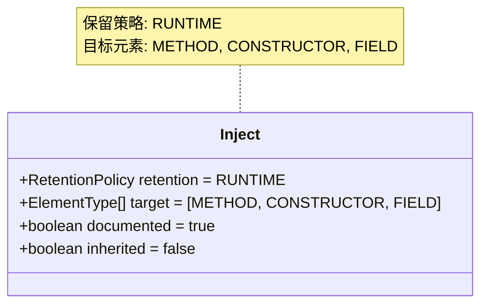
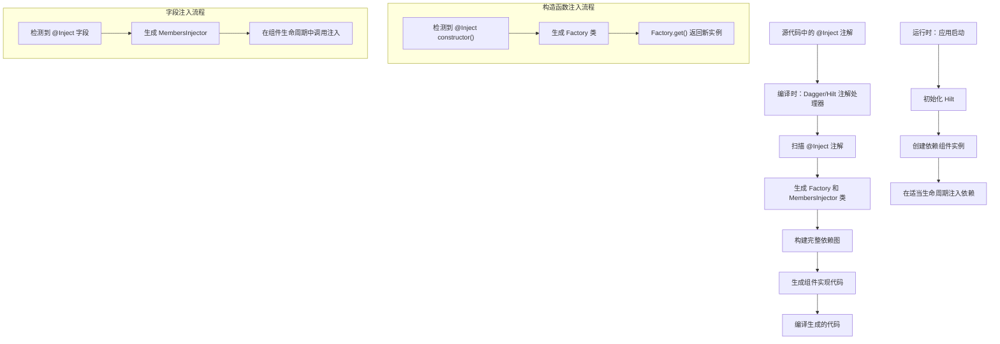
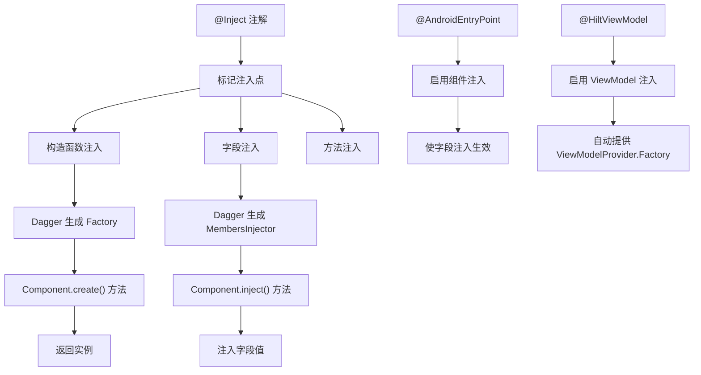
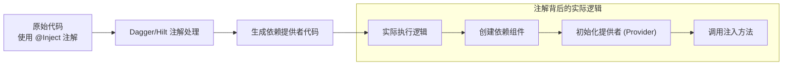
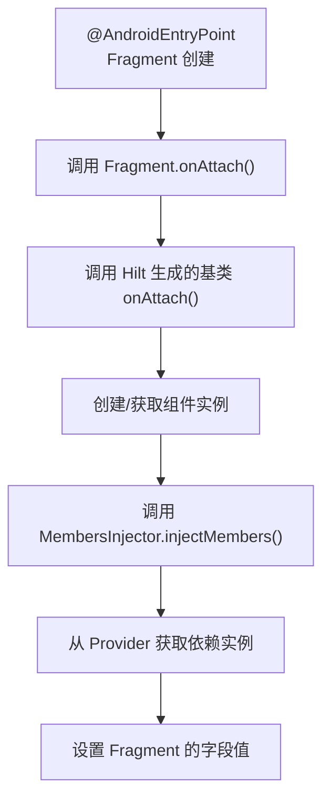
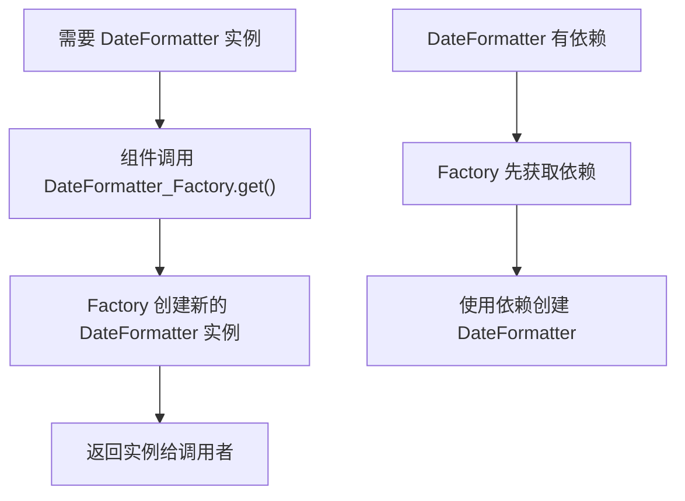
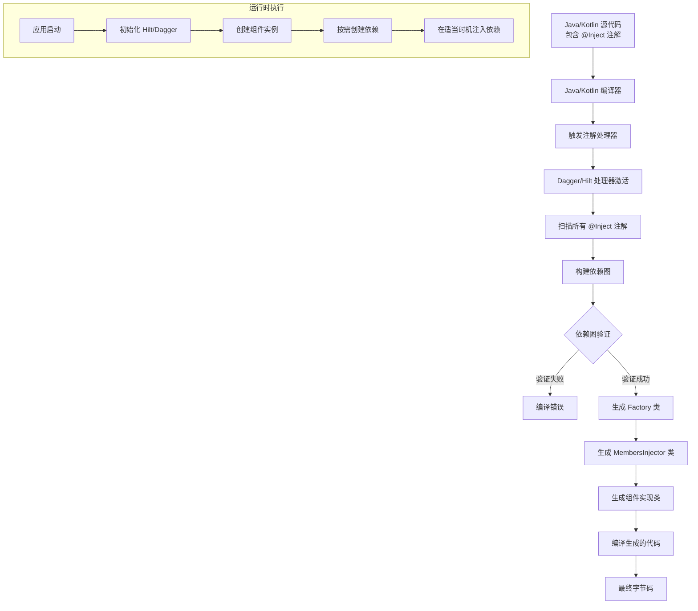
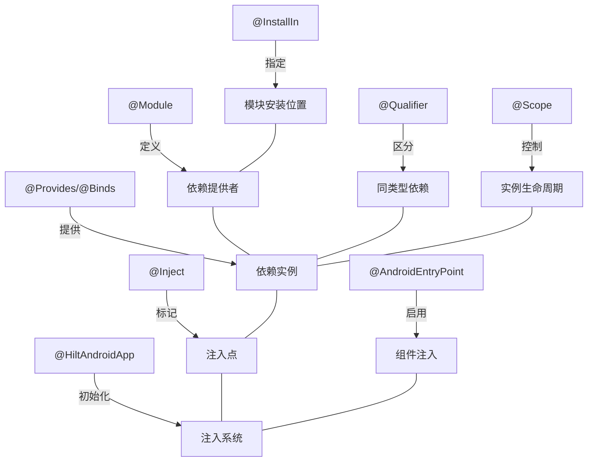

# `@Inject` 注解详解

## 注解基本信息

- **注解名称**：`javax.inject.Inject`
- **所属库/框架**：JSR-330 (Java 依赖注入规范)，在 Android 中由 Dagger/Hilt 实现
- **注解类型**：运行时注解，但在 Dagger/Hilt 中主要用于编译时处理
- **首次引入版本**：JSR-330 规范（2009 年），在 Android 中随 Dagger 1.0（2012 年）引入
- **官方文档链接**：[JSR-330 规范](https://jcp.org/en/jsr/detail?id=330)，[Dagger Hilt 文档](https://dagger.dev/hilt/)
- **对应概念**：
  - iOS: 类似 Swift 中的依赖注入容器，如 Swinject 中的 `@Injected` 属性包装器
  - Flutter: 类似 GetIt、injectable 库中的 `@injectable` 注解
  - React: 类似 React 中的 Context API 或 React Hooks 中的依赖注入机制
  - Spring: 类似 Spring 框架中的 `@Autowired` 注解

## 注解详细解析

### 注解定义

`@Inject` 注解是 JSR-330 依赖注入规范的一部分，它标记那些应该由依赖注入框架（如 Dagger/Hilt）提供依赖的位置。

```java
@Target({METHOD, CONSTRUCTOR, FIELD})
@Retention(RUNTIME)
@Documented
public @interface Inject {}
```



#### 元注解

`@Inject` 注解使用了以下元注解：

1. **@Target({METHOD, CONSTRUCTOR, FIELD})**：指定 `@Inject` 可以应用于方法、构造函数和字段。
   - 在 Dagger/Hilt 中，最常用的是构造函数注入和字段注入。
   - 方法注入在 Android 中使用较少。

2. **@Retention(RUNTIME)**：指定注解信息在运行时保留。
   - 虽然是运行时注解，但 Dagger/Hilt 在编译时就处理了大部分逻辑。
   - 运行时保留使得可以在特殊情况下通过反射处理注入。

3. **@Documented**：表示该注解应该包含在 JavaDoc 中。
   - 确保 API 文档中包含了关于依赖注入点的信息。

#### 属性

`@Inject` 注解没有任何属性或参数，它是一个标记注解（marker annotation），仅用于标识需要注入的目标。

#### 保留策略

`@Inject` 使用 `RetentionPolicy.RUNTIME` 保留策略，这意味着注解信息会保留在编译后的类文件中，并且在运行时可通过反射访问。

在 Dagger/Hilt 的实现中：
- 编译期间，注解处理器识别所有带有 `@Inject` 的元素，生成提供这些依赖的代码。
- 运行时，生成的代码负责实例化和提供依赖，一般不需要反射。

#### 目标元素

`@Inject` 可用于三种元素：

1. **构造函数 (CONSTRUCTOR)**：
   ```kotlin
   class DateFormatter @Inject constructor() { ... }
   ```
   - 表示该类的实例应由依赖注入框架提供。
   - Dagger/Hilt 将生成代码来实例化这个类。

2. **字段 (FIELD)**：
   ```kotlin
   @Inject lateinit var logger: LoggerDataSource
   ```
   - 表示该字段的值应由依赖注入框架提供。
   - 常用于 Android 组件中。

3. **方法 (METHOD)**：
   ```kotlin
   @Inject
   fun setLogger(logger: LoggerDataSource) { this.logger = logger }
   ```
   - 表示方法的参数由依赖注入框架提供，方法会被框架调用。
   - 在 Android 中较少使用。

#### 继承特性

`@Inject` 没有使用 `@Inherited` 元注解，因此它不会被子类继承。子类需要单独添加 `@Inject` 注解来标记其构造函数、字段或方法。 

### 注解工作原理

#### 注解处理时机

`@Inject` 注解的处理分为两个阶段：

1. **编译时处理**：
   - Dagger/Hilt 的注解处理器在编译时扫描代码中所有的 `@Inject` 注解。
   - 注解处理器生成用于依赖提供和注入的代码。
   - 验证依赖图，确保所有请求的依赖都能被满足。

2. **运行时执行**：
   - 运行时，应用启动后，生成的代码负责创建和管理对象实例。
   - 在适当的生命周期点，将依赖注入到标记的字段中。
   - 对于构造函数注入，创建对象时自动提供依赖。

#### 注解处理器

在 Hilt 中，`@Inject` 注解由 Dagger 的注解处理器处理，结合 Hilt 特定的组件生成逻辑：

1. **Dagger 处理器**：
   - 识别所有标记了 `@Inject` 的构造函数，生成 Factory 类来创建这些对象。
   - 收集所有的注入点（字段和方法），生成成员注入器。
   - 构建依赖图，检查循环依赖和缺失的绑定。

2. **Hilt 处理器**：
   - 将 Dagger 生成的代码与 Android 组件生命周期集成。
   - 生成 Android 特定的组件和模块，处理作用域。
   - 生成 `Hilt_` 前缀的基类，处理实际的注入逻辑。

#### 代码生成

对于每个带有 `@Inject` 注解的元素，Dagger/Hilt 会生成特定的代码：

1. **构造函数注入**：
   ```kotlin
   class DateFormatter @Inject constructor() { ... }
   ```
   
   生成的代码类似于：
   ```java
   public final class DateFormatter_Factory implements Factory<DateFormatter> {
     @Override
     public DateFormatter get() {
       return newInstance();
     }
   
     public static DateFormatter newInstance() {
       return new DateFormatter();
     }
   
     public static Factory<DateFormatter> create() {
       return InstanceHolder.INSTANCE;
     }
   
     private static final class InstanceHolder {
       private static final Factory<DateFormatter> INSTANCE = new DateFormatter_Factory();
     }
   }
   ```

2. **字段注入**：
   ```kotlin
   @Inject lateinit var logger: LoggerDataSource
   ```
   
   生成的代码类似于：
   ```java
   public final class ButtonsFragment_MembersInjector implements MembersInjector<ButtonsFragment> {
     private final Provider<LoggerDataSource> loggerProvider;
   
     public ButtonsFragment_MembersInjector(Provider<LoggerDataSource> loggerProvider) {
       this.loggerProvider = loggerProvider;
     }
   
     @Override
     public void injectMembers(ButtonsFragment instance) {
       injectLogger(instance, loggerProvider.get());
     }
   
     public static void injectLogger(ButtonsFragment instance, LoggerDataSource logger) {
       instance.logger = logger;
     }
   }
   ```

#### 字节码修改

`@Inject` 注解本身不直接修改字节码。相反，Dagger/Hilt 注解处理器生成新的 Java 源文件，这些源文件随后被编译成字节码。这种方法有几个优点：

1. **类型安全**：所有依赖关系在编译时验证。
2. **可调试性**：生成的代码可以被检查和调试。
3. **性能**：没有运行时反射开销。

相比之下，一些其他依赖注入框架（如 Guice）在运行时使用反射处理注解，这会导致更高的性能开销。

#### 反射使用

尽管 `@Inject` 是运行时注解，但 Dagger/Hilt 几乎不使用反射来处理它：

1. **编译时处理**：注解处理器在编译时读取注解信息。
2. **静态代码生成**：生成显式的注入代码，无需反射。
3. **有限的反射**：只在极少数情况下使用反射，比如处理无法在编译时解析的成员。

这种设计使 Dagger/Hilt 非常适合 Android，因为反射在 Android 上相对较慢且容易导致性能问题。

#### 工作流程图



## 注解使用方式

### 基本语法

`@Inject` 注解在不同场景下有不同的语法：

1. **构造函数注入（推荐）**：

   Kotlin:
   ```kotlin
   class DateFormatter @Inject constructor() {
       // 类的实现
   }
   ```

   Java:
   ```java
   public class DateFormatter {
       @Inject
       public DateFormatter() {
           // 构造函数实现
       }
   }
   ```

2. **字段注入**：

   Kotlin:
   ```kotlin
   @AndroidEntryPoint
   class ButtonsFragment : Fragment() {
       @Inject 
       lateinit var logger: LoggerDataSource
   }
   ```

   Java:
   ```java
   @AndroidEntryPoint
   public class ButtonsFragment extends Fragment {
       @Inject 
       LoggerDataSource logger;
   }
   ```

3. **方法注入（较少使用）**：

   Kotlin:
   ```kotlin
   @Inject
   fun setDependencies(logger: LoggerDataSource) {
       this.logger = logger
   }
   ```

   Java:
   ```java
   @Inject
   void setDependencies(LoggerDataSource logger) {
       this.logger = logger;
   }
   ```

### 位置用法

`@Inject` 注解在不同位置有不同的语义和使用场景：

1. **构造函数注入**：
   - 用于告诉 Dagger/Hilt 如何创建类的实例
   - 适用于自己创建的类，不能用于接口或第三方库中的类
   - 构造函数参数会自动被视为依赖并由 Dagger 提供
   - 示例：
     ```kotlin
     class LoggerInMemoryDataSource @Inject constructor() : LoggerDataSource { ... }
     ```

2. **字段注入**：
   - 用于在无法控制实例创建的情况下注入依赖（如 Android 组件）
   - 在 Android 中，需要配合 Hilt 的 `@AndroidEntryPoint` 等注解使用
   - 字段必须是可见的（不能是 private），在 Kotlin 中通常使用 `lateinit var`
   - 示例：
     ```kotlin
     @AndroidEntryPoint
     class LogsFragment : Fragment() {
         @Inject lateinit var dateFormatter: DateFormatter
     }
     ```

3. **方法注入**：
   - 用于需要在对象创建后执行某些初始化逻辑的场景
   - 方法参数会被视为依赖并由 Dagger 提供
   - 在 Android 中使用较少
   - 示例：
     ```kotlin
     @Inject
     fun initializeLogger(logger: LoggerDataSource) {
         // 初始化代码
     }
     ```

### 常见使用模式

1. **简单对象的构造函数注入**：

   ```kotlin
   // 无依赖的简单对象
   class DateFormatter @Inject constructor() {
       fun formatDate(timestamp: Long): String {
           // 实现
       }
   }
   ```

2. **带依赖的构造函数注入**：

   ```kotlin
   // 需要其他依赖的对象
   class LoggerLocalDataSource @Inject constructor(
       private val logDao: LogDao
   ) : LoggerDataSource {
       // 实现
   }
   ```

3. **Fragment/Activity 中的字段注入**：

   ```kotlin
   @AndroidEntryPoint
   class ButtonsFragment : Fragment() {
       // 使用限定符区分同一接口的不同实现
       @InMemoryLogger
       @Inject lateinit var logger: LoggerDataSource
       
       @Inject lateinit var navigator: AppNavigator
   }
   ```

4. **ViewModel 中的构造函数注入**：

   ```kotlin
   @HiltViewModel
   class LogsViewModel @Inject constructor(
       private val loggerDataSource: LoggerDataSource,
       private val dateFormatter: DateFormatter
   ) : ViewModel() {
       // ViewModel 实现
   }
   ```

### 组合使用

`@Inject` 注解通常与其他 Dagger/Hilt 注解组合使用：

1. **与 Android 组件注解配合**：
   - `@AndroidEntryPoint`：使 Android 组件能够接收依赖注入
   - `@HiltViewModel`：标记可注入的 ViewModel

   ```kotlin
   @AndroidEntryPoint
   class MainActivity : AppCompatActivity() {
       @Inject lateinit var navigator: AppNavigator
   }
   
   @HiltViewModel
   class MainViewModel @Inject constructor(repository: UserRepository) : ViewModel()
   ```

2. **与限定符注解配合**：
   - 使用 `@Qualifier` 注解区分同一类型的不同实现

   ```kotlin
   // 定义限定符
   @Qualifier
   annotation class InMemoryLogger
   
   // 使用限定符标记实现
   class LoggerInMemoryDataSource @Inject constructor() : LoggerDataSource
   
   // 使用限定符注入特定实现
   @InMemoryLogger
   @Inject lateinit var logger: LoggerDataSource
   ```

3. **与作用域注解配合**：
   - 使用作用域注解控制对象的生命周期

   ```kotlin
   // 单例作用域
   @Singleton
   class UserRepository @Inject constructor() { ... }
   
   // Activity 作用域
   @ActivityScoped
   class Navigator @Inject constructor(activity: Activity) { ... }
   ```

### API 调用关系



### 与其他框架对比

1. **Spring 框架**：
   - Spring 使用 `@Autowired` 代替 `@Inject`
   - Spring 主要依赖运行时反射，Dagger/Hilt 使用编译时代码生成
   - 示例对比：
     ```kotlin
     // Hilt/Dagger 使用 @Inject
     @Inject lateinit var service: UserService
     
     // Spring 使用 @Autowired
     @Autowired lateinit var service: UserService
     ```

2. **iOS 依赖注入**：
   - Swift 没有内置的依赖注入框架
   - 第三方库如 Swinject 提供类似功能
   - 示例对比：
     ```swift
     // Swift 使用 Swinject 的 @Injected 属性包装器
     @Injected var service: UserService
     
     // Kotlin 使用 @Inject
     @Inject lateinit var service: UserService
     ```

3. **Flutter 依赖注入**：
   - Flutter 使用 provider 包或 GetIt 等第三方库
   - injectable 库提供基于注解的依赖注入
   - 示例对比：
     ```dart
     // Flutter 使用 injectable
     @injectable
     class UserService { ... }
     
     // Kotlin 使用 @Inject
     class UserService @Inject constructor() { ... }
     ```

## 注解效果分析

### 编译前代码

以下是使用 `@Inject` 注解前的原始代码：

构造函数注入：
```kotlin
// 没有 @Inject 的简单类
class DateFormatter {
    private val formatter = SimpleDateFormat("d MMM yyyy HH:mm:ss")

    fun formatDate(timestamp: Long): String {
        return formatter.format(Date(timestamp))
    }
}

// 没有 @Inject 的 Fragment
class ButtonsFragment : Fragment() {
    // 手动初始化依赖
    private lateinit var logger: LoggerDataSource
    private lateinit var navigator: AppNavigator
    
    override fun onCreate(savedInstanceState: Bundle?) {
        super.onCreate(savedInstanceState)
        // 手动创建或获取依赖
        logger = LoggerInMemoryDataSource()
        navigator = AppNavigatorImpl(requireActivity())
    }
}
```

### 编译后效果

添加 `@Inject` 注解并使用 Hilt 后的代码：

构造函数注入：
```kotlin
// 使用 @Inject 标记构造函数
class DateFormatter @Inject constructor() {
    private val formatter = SimpleDateFormat("d MMM yyyy HH:mm:ss")

    fun formatDate(timestamp: Long): String {
        return formatter.format(Date(timestamp))
    }
}

// 使用 Hilt 的 Fragment
@AndroidEntryPoint
class ButtonsFragment : Fragment() {
    // 使用 @Inject 标记需要注入的字段
    @InMemoryLogger
    @Inject lateinit var logger: LoggerDataSource
    @Inject lateinit var navigator: AppNavigator
    
    // 不再需要手动初始化，Hilt 会自动注入
}
```

Dagger/Hilt 生成的实际执行代码（简化版）：

```java
// 为 DateFormatter 生成的工厂类
public final class DateFormatter_Factory implements Factory<DateFormatter> {
    @Override
    public DateFormatter get() {
        return newInstance();
    }
    
    public static DateFormatter newInstance() {
        return new DateFormatter();
    }
    
    public static Factory<DateFormatter> create() {
        return InstanceHolder.INSTANCE;
    }
    
    private static final class InstanceHolder {
        private static final Factory<DateFormatter> INSTANCE = new DateFormatter_Factory();
    }
}

// 为 ButtonsFragment 生成的成员注入器
public final class ButtonsFragment_MembersInjector 
        implements MembersInjector<ButtonsFragment> {
    
    private final Provider<LoggerDataSource> loggerProvider;
    private final Provider<AppNavigator> navigatorProvider;
    
    public ButtonsFragment_MembersInjector(
            Provider<LoggerDataSource> loggerProvider,
            Provider<AppNavigator> navigatorProvider) {
        this.loggerProvider = loggerProvider;
        this.navigatorProvider = navigatorProvider;
    }
    
    @Override
    public void injectMembers(ButtonsFragment instance) {
        instance.logger = loggerProvider.get();
        instance.navigator = navigatorProvider.get();
    }
}

// Hilt 生成的 Fragment 基类
public abstract class Hilt_ButtonsFragment extends Fragment {
    private FragmentComponentManager componentManager;
    
    @Override
    public void onAttach(Context context) {
        super.onAttach(context);
        // 初始化组件管理器
        componentManager = createComponentManager();
        // 注入依赖
        componentManager.inject(this);
    }
    
    // 其他生命周期方法...
}
```

### 执行逻辑图解



字段注入的详细流程：



构造函数注入的详细流程：



### 运行时行为

`@Inject` 注解会影响对象的创建和获取方式：

1. **构造函数注入**：
   - 使用 `@Inject` 标记的构造函数告诉 Dagger/Hilt 如何创建该类的实例
   - 运行时，当需要此类的实例时，Dagger 会调用其生成的 Factory 类
   - Factory 负责获取构造函数的所有依赖，然后创建新实例

2. **字段注入**：
   - 使用 `@Inject` 标记的字段会在组件的特定生命周期点被初始化
   - 对于 Activity/Fragment，这发生在 `onCreate()/onAttach()` 之前
   - Dagger 创建的 MembersInjector 负责设置字段值

3. **依赖获取顺序**：
   - Dagger 首先解析所有依赖关系，创建依赖树
   - 依赖按需创建，通常是延迟实例化的
   - 单例依赖只创建一次，其他依赖可能根据作用域多次创建

### 生命周期影响

在 Android 中，`@Inject` 与组件生命周期紧密相关：

1. **组件创建与依赖注入的关系**：
   - Activities: 在 `onCreate()` 之前完成注入
   - Fragments: 在 `onAttach()` 期间完成注入
   - Views: 在构造函数之后完成注入
   - Services: 在 `onCreate()` 之前完成注入
   - ViewModels: 在 ViewModel 创建时注入

2. **依赖作用域与组件生命周期**：
   - `@Singleton`: 应用进程生命周期
   - `@ActivityRetainedScoped`: 跨配置变更的 Activity 生命周期
   - `@ActivityScoped`: Activity 生命周期
   - `@FragmentScoped`: Fragment 生命周期

3. **注入点的可见性要求**：
   - 被注入字段不能是 private
   - Kotlin 中通常使用 `lateinit var` 防止空值

### 差异对比

使用 `@Inject` 前后的代码对比：

```kotlin
// 不使用依赖注入
class LogsFragment : Fragment() {
    // 手动创建所有依赖
    private val dateFormatter = DateFormatter()
    private lateinit var logger: LoggerDataSource
    
    override fun onCreate(savedInstanceState: Bundle?) {
        super.onCreate(savedInstanceState)
        // 手动初始化，需要知道具体实现
        logger = LoggerInMemoryDataSource()
    }
    
    // 使用依赖
    fun displayLogs() {
        logger.getAllLogs { logs ->
            // 显示日志
            for (log in logs) {
                val formattedDate = dateFormatter.formatDate(log.timestamp)
                // 更新 UI
            }
        }
    }
}

// 使用 @Inject 和 Hilt
@AndroidEntryPoint
class LogsFragment : Fragment() {
    // 注入依赖，不需要知道具体实现
    @Inject lateinit var dateFormatter: DateFormatter
    @InMemoryLogger
    @Inject lateinit var logger: LoggerDataSource
    
    // 不需要手动初始化
    
    // 使用依赖
    fun displayLogs() {
        logger.getAllLogs { logs ->
            // 显示日志
            for (log in logs) {
                val formattedDate = dateFormatter.formatDate(log.timestamp)
                // 更新 UI
            }
        }
    }
}
```

主要区别：
1. 使用 `@Inject` 后，不需要手动创建依赖
2. 代码更专注于业务逻辑，减少了样板代码
3. 依赖解耦，Fragment 不需要了解依赖的具体实现
4. 可以轻松切换实现（例如使用不同的限定符）
5. 更容易进行测试，可以替换模拟实现

## 性能与安全考虑

### 编译时开销

使用 `@Inject` 注解会增加编译时的开销：

1. **增加编译时间**：
   - Dagger/Hilt 注解处理会分析代码中的依赖关系，生成额外的源代码
   - 在大型项目中，可能显著增加编译时间
   - 增量编译可以减轻这一问题，但第一次编译仍需较长时间

2. **编译时验证**：
   - Dagger/Hilt 在编译时验证依赖图，确保所有依赖都能被满足
   - 如果依赖图中有问题（如缺少绑定或循环依赖），编译将失败
   - 这有助于尽早发现问题，但也可能导致较长的调试时间

3. **生成代码量**：
   - 每个 `@Inject` 注解都会导致生成额外的代码
   - 过多的依赖注入会增加应用程序的方法数和代码大小
   - 在大型应用中需要注意这一点，避免超出 DEX 限制

### 运行时开销

相对于编译时开销，`@Inject` 在 Dagger/Hilt 中的运行时开销较小：

1. **实例化成本**：
   - 依赖注入本身基本没有额外的实例化成本
   - 生成的代码类似于手动创建对象的代码
   - 性能与手动编写的工厂模式相当

2. **内存使用**：
   - 单例和作用域依赖会在其作用域内保持活跃，可能增加内存使用
   - 与作用域类型不匹配的依赖可能导致内存泄漏
   - 例如，如果将 Activity 注入到 `@Singleton` 依赖中，即使 Activity 被销毁，也不会被垃圾回收

3. **启动时间影响**：
   - 应用启动时需要初始化依赖图和单例对象
   - 如果有大量单例依赖，可能增加应用冷启动时间
   - 可以通过延迟初始化或使用 `Lazy<T>` 来优化

### 反射风险

Dagger/Hilt 的一大优势是最小化反射使用：

1. **编译时代码生成**：
   - Dagger/Hilt 在编译时生成代码，运行时几乎不使用反射
   - 这避免了反射带来的性能开销
   - 在 Android 上尤为重要，因为 Android 的 ART 虚拟机对反射优化有限

2. **极少数反射用例**：
   - 在某些边缘情况下，Dagger 可能会使用少量反射
   - 例如，访问某些不可访问的字段或方法
   - 这些情况在标准 Android 应用中很少见

3. **与其他框架对比**：
   - 相比之下，Guice 或 Spring 等框架大量使用反射
   - 这使 Dagger/Hilt 在 Android 上更具性能优势

### ProGuard 配置

使用 `@Inject` 注解时需要特别注意 ProGuard 配置，以确保代码缩减和混淆不会破坏依赖注入：

1. **保留注解**：
   ```
   -keepclasseswithmembers class * {
       @javax.inject.Inject <init>(...);
   }
   
   -keepclasseswithmembers class * {
       @javax.inject.Inject <fields>;
   }
   ```

2. **保留模块**：
   ```
   -keep class * extends dagger.Module
   ```

3. **保留组件**：
   ```
   -keep class * extends dagger.Component
   ```

4. **保留 Hilt 生成的类**：
   ```
   -keep class * extends dagger.hilt.android.internal.managers.** { *; }
   ```

5. **保留入口点**：
   ```
   -keep @dagger.hilt.EntryPoint class *
   ```

Hilt 会自动为项目提供基本的 ProGuard 规则，但对于复杂项目可能需要额外配置。

### 安全最佳实践

使用 `@Inject` 和依赖注入时的安全最佳实践：

1. **避免在依赖中存储敏感信息**：
   - 不要在可注入对象中存储未加密的密钥、令牌或凭据
   - 单例依赖在整个应用生命周期内存在，增加敏感数据暴露风险

2. **注意线程安全**：
   - 作用域依赖（特别是单例）可能被多个线程同时访问
   - 确保这些依赖的实现是线程安全的
   - 使用不可变对象或适当的同步机制

3. **防止空注入**：
   - Dagger/Hilt 在编译时会检查大多数依赖，但运行时仍可能有空值
   - 在使用 `@Inject` 字段前检查其初始化
   - 在 Kotlin 中使用 `lateinit var` 可以帮助防止空值

4. **注意特权提升**：
   - 不要从低权限组件向高权限组件注入依赖
   - 遵循最小权限原则，限制依赖访问范围

5. **测试替换**：
   - 设计依赖接口支持测试中替换为模拟实现
   - 使用依赖注入使代码更易于测试是一大优势

### 与其他机制对比

`@Inject` 和依赖注入与其他依赖管理机制的性能对比：

1. **与服务定位器模式对比**：
   - 服务定位器通常使用全局注册表管理依赖
   - 服务定位器运行时开销略低，但牺牲了编译时安全
   - 依赖注入提供更好的可测试性和更低的耦合

2. **与工厂模式对比**：
   - 手动编写的工厂模式可能有略微更好的性能
   - 但工厂模式需要编写和维护大量样板代码
   - 依赖注入通过自动生成代码提供更好的开发效率

3. **与单例模式对比**：
   - 全局单例模式访问速度快但导致高耦合
   - 测试困难，难以替换实现
   - 依赖注入的单例更灵活，作用域可控

4. **与手动依赖传递对比**：
   - 手动传递依赖在运行时没有额外开销
   - 但需要大量样板代码，且在依赖链深时难以管理
   - 依赖注入自动处理依赖传递，简化代码

## 注解实现机制

### APT 实现

`@Inject` 注解在 Dagger/Hilt 中通过注解处理工具（APT）实现：

1. **APT 工作原理**：
   - APT 是 Java 编译器的一部分，允许在编译期间处理注解
   - 它能够分析源代码，访问注解信息，并生成新的源文件
   - 生成的源文件随后被编译为字节码

2. **Dagger/Hilt 处理流程**：
   - 源代码编译阶段，APT 扫描所有带有 `@Inject` 注解的元素
   - 注解处理器收集这些信息，构建依赖关系图
   - 处理器验证图的有效性，没有缺失的绑定或循环依赖
   - 生成用于创建和提供这些依赖的代码
   - 生成的代码被编译并打包进应用

3. **处理循环**：
   - APT 可能进行多轮处理，每轮生成新源文件
   - 在 Dagger/Hilt 中，可能需要多轮来解析所有依赖关系
   - 每轮处理后，APT 检查是否需要额外的处理轮次

### 注解处理器注册

Dagger/Hilt 的注解处理器在 META-INF/services 目录中注册：

1. **注册文件**：
   ```
   META-INF/services/javax.annotation.processing.Processor
   ```

2. **处理器类**：
   - `dagger.hilt.processor.internal.root.RootProcessor`
   - `dagger.internal.codegen.ComponentProcessor`
   - 其他特定的处理器类

3. **自动发现机制**：
   - Java/Kotlin 编译器使用服务提供者机制自动发现这些处理器
   - 处理器按照特定顺序运行，处理各种注解
   - Hilt 处理器会在 Dagger 处理器之上增加 Android 特定功能

### 处理器源码分析

Dagger/Hilt 处理 `@Inject` 注解的关键处理器：

1. **InjectBindingRegistry**：
   - 收集所有带有 `@Inject` 构造函数的类
   - 为每个类创建一个 `ProvisionBinding` 对象
   - 这些绑定描述如何创建依赖实例

2. **MembersInjectionBindingGenerator**：
   - 处理所有带有 `@Inject` 字段或方法的类
   - 生成注入这些成员的代码
   - 创建 `MembersInjectionBinding` 对象

3. **SourceFileGenerator**：
   - 使用 JavaPoet 库生成 Factory 和 MembersInjector 类
   - 处理不同类型的依赖和作用域

4. **HiltProcessor**：
   - Hilt 特定的处理器，扩展 Dagger 功能
   - 处理 Android 特定注解和组件生命周期
   - 生成 Android 组件的基类和辅助类

### 字节码生成

Dagger/Hilt 使用 JavaPoet 库生成源代码，而不是直接修改字节码：

1. **Factory 类生成**：
   - 为每个标记了 `@Inject` 构造函数的类生成一个 Factory 类
   - Factory 负责创建依赖实例
   - 示例代码（简化版）：

   ```java
   public final class DateFormatter_Factory implements Factory<DateFormatter> {
     public static DateFormatter newInstance() {
       return new DateFormatter();
     }
     
     @Override
     public DateFormatter get() {
       return newInstance();
     }
     
     public static Factory<DateFormatter> create() {
       return InstanceHolder.INSTANCE;
     }
     
     private static final class InstanceHolder {
       private static final Factory<DateFormatter> INSTANCE = new DateFormatter_Factory();
     }
   }
   ```

2. **MembersInjector 类生成**：
   - 为每个包含 `@Inject` 字段或方法的类生成一个 MembersInjector 类
   - 负责注入依赖到标记的字段或调用标记的方法
   - 示例代码（简化版）：

   ```java
   public final class LogsFragment_MembersInjector implements MembersInjector<LogsFragment> {
     private final Provider<LoggerDataSource> loggerProvider;
     private final Provider<DateFormatter> dateFormatterProvider;
     
     public LogsFragment_MembersInjector(
         Provider<LoggerDataSource> loggerProvider,
         Provider<DateFormatter> dateFormatterProvider) {
       this.loggerProvider = loggerProvider;
       this.dateFormatterProvider = dateFormatterProvider;
     }
     
     @Override
     public void injectMembers(LogsFragment instance) {
       injectLogger(instance, loggerProvider.get());
       injectDateFormatter(instance, dateFormatterProvider.get());
     }
     
     public static void injectLogger(LogsFragment instance, LoggerDataSource logger) {
       instance.logger = logger;
     }
     
     public static void injectDateFormatter(LogsFragment instance, DateFormatter dateFormatter) {
       instance.dateFormatter = dateFormatter;
     }
   }
   ```

3. **Component 类生成**：
   - 生成组件实现类，将所有依赖绑定在一起
   - 处理不同作用域和子组件关系
   - 示例代码（简化版）：

   ```java
   public final class DaggerSingletonComponent implements SingletonComponent {
     private final DatabaseModule databaseModule;
     private final Provider<LogDao> provideLogDaoProvider;
     private final Provider<LoggerLocalDataSource> loggerLocalDataSourceProvider;
     
     private DaggerSingletonComponent(DatabaseModule databaseModuleParam) {
       this.databaseModule = databaseModuleParam;
       this.provideLogDaoProvider = DoubleCheck.provider(
           DatabaseModule_ProvideLogDaoFactory.create(databaseModule));
       this.loggerLocalDataSourceProvider = LoggerLocalDataSource_Factory.create(provideLogDaoProvider);
     }
     
     @Override
     public void inject(LogsFragment fragment) {
       LogsFragment_MembersInjector.injectLogger(
           fragment, loggerLocalDataSourceProvider.get());
       LogsFragment_MembersInjector.injectDateFormatter(
           fragment, dateFormatterProvider.get());
     }
     
     // 其他方法...
   }
   ```

### 依赖注入原理

基于 `@Inject` 注解的依赖注入包括以下核心原理：

1. **依赖提供**：
   - 使用 `@Inject` 标记的构造函数指示如何创建依赖
   - 使用 `@Provides` 方法提供无法直接注入的依赖（如接口或第三方类）
   - 使用 `@Binds` 方法绑定接口到实现

2. **依赖图构建**：
   - Dagger 在编译时构建完整的依赖图
   - 验证所有依赖都能被满足
   - 检查循环依赖和其他问题

3. **依赖注入类型**：
   - 构造函数注入：通过构造函数提供依赖
   - 字段注入：直接设置类的字段
   - 方法注入：调用方法并提供参数

4. **作用域管理**：
   - 单例作用域：整个应用生命周期内只创建一次
   - 组件作用域：在组件生命周期内只创建一次
   - 非作用域：每次请求都创建新实例

5. **Android 集成**：
   - Hilt 将 Dagger 与 Android 组件生命周期集成
   - 为每种 Android 组件类型提供特定的注入时机
   - 自动处理配置变更和组件销毁

### 技术原理图



## 版本兼容性

### API 变更

`@Inject` 注解本身是 JSR-330 标准的一部分，相对稳定，但 Dagger/Hilt 的实现有一些重要变更：

1. **Dagger 变更**：
   - Dagger 1.x（2013 年）：最初版本，使用镜像 API 和运行时代码
   - Dagger 2.0（2014 年）：完全重写，使用编译时代码生成，消除反射
   - Dagger 2.10+（2017 年）：改进了 Android 支持
   - Dagger 2.20+（2019 年）：组件工厂和更多 Android 改进

2. **Hilt 变更**：
   - Hilt 1.0.0-alpha01（2020 年）：初始发布，简化 Android 中的 Dagger 使用
   - Hilt 1.0.0（2021 年）：稳定版发布
   - Hilt 2.40+：改进了 ViewModel 注入和测试支持
   - Hilt 2.44+：支持 Java 17 和更新的 Gradle 版本

3. **主要 API 变化**：
   - 从 `@Component.Builder` 到 `@Component.Factory`
   - 从 `@ActivityScoped` 到 `@ActivityRetainedScoped` 引入
   - 组件命名从 `ApplicationComponent` 变为 `SingletonComponent`

### 行为差异

`@Inject` 在不同 Android 版本和 Dagger/Hilt 版本中的行为差异：

1. **Android 版本差异**：
   - Android 5.0 (API 21) 及以下：ProGuard 规则更复杂，需要额外配置
   - Android 6.0+ (API 23+)：ART 运行时改进反射性能
   - Android 10+ (API 29+)：非 SDK 接口限制可能影响某些注入场景

2. **编译时行为差异**：
   - 较旧版本：更简单的验证，可能允许一些现在会失败的代码
   - 较新版本：更严格的验证，捕获更多潜在问题
   - Dagger 2.31+：改进了循环依赖的检测和错误消息

3. **运行时行为差异**：
   - Dagger 1.x：使用反射，在低端设备上性能较差
   - Dagger 2.x：几乎没有反射，性能更好
   - Hilt：优化了 Android 组件生命周期集成

### 废弃信息

虽然 `@Inject` 本身未被废弃，但在 Dagger/Hilt 生态系统中有一些废弃和迁移：

1. **废弃的 API**：
   - `dagger.android` 包：被 Hilt 取代
   - `@Component.Builder`：推荐使用 `@Component.Factory`
   - `ApplicationComponent`：重命名为 `SingletonComponent`

2. **替代建议**：
   - 如使用 `dagger.android`，迁移到 Hilt
   - 如使用字段注入，尽可能转向构造函数注入
   - 如直接使用 Dagger，考虑迁移到 Hilt

3. **迁移路径**：
   - Dagger -> Hilt：[官方迁移指南](https://dagger.dev/hilt/migration-guide)
   - 实施分阶段迁移，可以同时使用 Dagger 和 Hilt

### Kotlin 支持

`@Inject` 在 Kotlin 中的使用有一些特殊考虑：

1. **Kotlin 特性支持**：
   - 支持 Kotlin 的构造函数参数属性
   - 支持 `lateinit var` 用于字段注入
   - 使用 `@JvmField` 可能需要额外注意

2. **KAPT vs KSP**：
   - 早期 Hilt 版本使用 KAPT（Kotlin 注解处理工具）
   - KSP（Kotlin 符号处理）提供更快的编译时间
   - Hilt 2.44+ 实验性支持 KSP

3. **Kotlin 特有注意事项**：
   - 私有字段和属性无法被注入
   - 对象实例化顺序与 Java 不同
   - 单例对象需要特别处理

4. **Kotlin 特定的语法**：
   ```kotlin
   // Kotlin 中的构造函数注入
   class MyService @Inject constructor(
       private val repository: Repository,
       private val analytics: Analytics
   ) {
       // 实现
   }
   
   // Kotlin 中的字段注入
   @AndroidEntryPoint
   class MyFragment : Fragment() {
       @Inject lateinit var service: MyService
   }
   ```

### Java 兼容性

`@Inject` 在 Java 和 Kotlin 混合项目中的使用：

1. **Java 与 Kotlin 互操作**：
   - Java 代码可以注入 Kotlin 类，反之亦然
   - Kotlin 属性在 Java 中表现为 getter/setter
   - Java 中的字段在 Kotlin 中需要特殊处理

2. **混合项目的最佳实践**：
   - 在接口定义上保持一致
   - 使用构造函数注入减少互操作问题
   - 对于 Java 代码，考虑使用 `@Nullable` 和 `@NonNull` 注解

3. **Java 到 Kotlin 迁移**：
   - 可以逐步迁移，不需要一次性转换所有代码
   - 注入在混合代码中正常工作
   - 注意 Kotlin 的 null 安全机制与 Java 的区别

## 相关注解

### 同类注解

`@Inject` 与其他类似功能的注解对比：

1. **`@javax.inject.Inject`** (JSR-330)：
   - 标准依赖注入注解，被 Dagger/Hilt 实现
   - 可用于构造函数、字段和方法
   - 运行时保留

2. **`@Autowired`** (Spring)：
   - Spring 框架的依赖注入注解
   - 基于反射实现，运行时注入
   - 支持自动类型匹配和名称匹配

3. **`@Inject`** (Guice)：
   - Google Guice 框架的依赖注入注解
   - 运行时基于反射实现
   - 与 JSR-330 兼容

4. **`@injectable`** (Flutter/injectable)：
   - Flutter 库中的依赖注入注解
   - 生成代码用于 GetIt 服务定位器
   - 编译时处理

### 配套注解

`@Inject` 通常与以下 Dagger/Hilt 注解一起使用：

1. **容器注解**：
   - **`@HiltAndroidApp`**：Android 应用入口点，初始化 Hilt
   - **`@AndroidEntryPoint`**：标记可接收依赖注入的 Android 组件

2. **绑定注解**：
   - **`@Binds`**：绑定接口到其实现
   - **`@Provides`**：提供依赖实例的方法
   - **`@Module`**：包含依赖提供方法的类

3. **作用域注解**：
   - **`@Singleton`**：应用级单例
   - **`@ActivityScoped`**：Activity 生命周期作用域
   - **`@FragmentScoped`**：Fragment 生命周期作用域

4. **限定符注解**：
   - **`@Qualifier`**：标记自定义限定符注解
   - **`@Named`**：基于名称的简单限定符

5. **组件注解**：
   - **`@Component`**：定义依赖容器
   - **`@InstallIn`**：指定模块安装位置
   - **`@HiltViewModel`**：标记支持注入的 ViewModel

### 替代方案

`@Inject` 和依赖注入的一些替代方案及其对比：

1. **服务定位器模式**：
   - 全局注册表存储和获取依赖
   - 优点：实现简单，不需要编译时工具
   - 缺点：运行时类型安全性差，隐藏依赖关系

2. **工厂模式**：
   - 专用工厂类创建和提供依赖
   - 优点：显式依赖关系，无需注解处理
   - 缺点：需要手写大量样板代码

3. **手动依赖传递**：
   - 通过构造函数或方法参数显式传递所有依赖
   - 优点：最大的透明度和控制
   - 缺点：深层依赖链时代码冗长

4. **Android 特定方法**：
   - ViewModelProvider 和 SavedStateHandle
   - 系统服务获取（getSystemService）
   - 优点：与 Android 框架无缝集成
   - 缺点：仅适用于特定场景，不是通用解决方案

### 库内注解体系

`@Inject` 在 Dagger/Hilt 注解体系中的位置：



### 注解对比表

| 注解 | 框架 | 使用位置 | 处理时机 | 反射使用 | 主要特点 |
|------|------|----------|----------|----------|----------|
| @Inject | Dagger/Hilt | 构造函数、字段、方法 | 编译时 | 最小化 | 编译时验证，高性能 |
| @Autowired | Spring | 构造函数、字段、方法 | 运行时 | 大量 | 灵活，自动装配 |
| @Inject | Guice | 构造函数、字段、方法 | 运行时 | 大量 | 灵活，运行时匹配 |
| @injectable | Flutter | 类 | 编译时 | 无 | 代码生成，GetIt 集成 |
| @Injection | SwiftUI | 属性包装器 | 编译时 | 无 | 类型安全，值语义 |

## Java/Kotlin 注解基础知识

### 注解基本概念

Java/Kotlin 的注解系统：

1. **注解定义**：
   - 注解是元数据，可附加到代码元素
   - 用于提供编译器或运行时信息
   - 在 Java 中使用 `@interface` 关键字定义
   - 在 Kotlin 中使用 `annotation class` 定义

2. **注解用途**：
   - 编译时信息：供编译器使用
   - 编译时处理：生成代码或验证
   - 运行时处理：通过反射获取信息
   - 文档生成：生成 API 文档

3. **注解语法**：
   ```kotlin
   // Kotlin 定义注解
   @Target(AnnotationTarget.CLASS, AnnotationTarget.FUNCTION)
   @Retention(AnnotationRetention.RUNTIME)
   annotation class MyAnnotation(val value: String = "")
   
   // 使用注解
   @MyAnnotation("示例")
   class MyClass
   ```

### 元注解系统

Java/Kotlin 的元注解用于定义注解本身的特性：

1. **@Target**：
   - 指定注解可以应用的代码元素类型
   - Java：ElementType 枚举（TYPE, FIELD, METHOD 等）
   - Kotlin：AnnotationTarget 枚举（CLASS, FUNCTION, PROPERTY 等）

2. **@Retention**：
   - 指定注解信息的保留级别
   - SOURCE：仅源代码，编译后丢弃
   - CLASS：保留在类文件中，但运行时不可用
   - RUNTIME：在运行时通过反射可用

3. **@Documented**：
   - 表示注解应该包含在 JavaDoc 中
   - 影响文档生成

4. **@Inherited**：
   - 表示注解可以被子类继承
   - 子类会自动获得父类的注解

5. **@Repeatable**：
   - 允许同一个元素多次使用同一注解
   - 需要定义容器注解

### 注解处理器

Java 注解处理器（APT）是处理注解的工具：

1. **APT 工作原理**：
   - 实现 `javax.annotation.processing.Processor` 接口
   - 在编译期间运行，访问注解信息
   - 可以生成新的源文件，但不能修改现有文件
   - 可以产生编译错误或警告

2. **处理循环**：
   - 每轮处理中扫描源文件和前一轮生成的文件
   - 可能进行多轮处理直到没有新文件生成
   - 每轮处理都可以声明需要处理的注解类型

3. **注解处理器注册**：
   - 通过 META-INF/services 机制注册
   - 或通过构建系统配置（如 Gradle）

### Kotlin 注解特性

Kotlin 的注解系统有一些特殊特性：

1. **用法目标**：
   - Kotlin 可以指定注解应用的精确目标
   - 使用 `@get:Inject`、`@field:Inject` 等形式
   - 可以针对属性的不同部分应用不同注解

2. **类型使用注解**：
   - Kotlin 支持类型使用注解，如泛型参数上的注解
   - 可用于空安全等场景

3. **函数式 API**：
   - 结合高阶函数和 DSL 使用注解
   - 构建更具表现力的 API

4. **协程支持**：
   - 注解可以用于挂起函数和其他协程相关元素
   - 特殊处理挂起函数的注解处理

### KAPT 与 KSP

Kotlin 的注解处理工具：

1. **KAPT**：
   - Kotlin 注解处理工具，基于 Java APT
   - 将 Kotlin 代码转为 Java 存根，然后运行 Java 处理器
   - 性能开销大，编译较慢

2. **KSP**：
   - Kotlin 符号处理，基于 Kotlin 编译器 API
   - 直接处理 Kotlin 代码，无需 Java 转换
   - 性能更好，编译更快
   - 与 Hilt 的兼容性正在改进

3. **两者对比**：
   - KAPT：成熟但速度慢，完全兼容 Java 处理器
   - KSP：较新但速度快，可能不完全兼容所有 Java 处理器
   - Hilt/Dagger 兼容性：KAPT 完全支持，KSP 部分支持

### 与其他语言对比

Java/Kotlin 注解系统与其他语言类似机制的对比：

1. **Swift Attributes**：
   - 使用 `@` 前缀，如 `@available`、`@discardableResult`
   - 内置属性由编译器识别
   - 可以定义自定义属性，但功能有限

2. **TypeScript Decorators**：
   - 使用 `@` 前缀，如 `@Component`、`@Input`
   - 实现基于 JavaScript 元编程能力
   - 在运行时修改类和成员行为

3. **Python Decorators**：
   - 使用 `@` 前缀，如 `@property`、`@classmethod`
   - 是可调用对象，可修改函数或类
   - 运行时机制，非声明式

4. **C# Attributes**：
   - 使用方括号语法，如 `[Serializable]`
   - 可以通过反射访问
   - 与 Java 注解概念相似

## 实际应用场景

### 框架应用

`@Inject` 在主流框架中的应用：

1. **Android 架构组件**：
   - 结合 ViewModel 实现 UI 状态管理
   - 与 Room 集成注入数据库
   - 与 WorkManager 集成后台任务

2. **网络库集成**：
   - 注入 Retrofit 服务
   - 注入 OkHttp 客户端
   - 注入网络状态监听器

3. **多模块项目**：
   - 在模块边界提供依赖
   - 减少模块间耦合
   - 实现功能模块的可插拔

4. **测试场景**：
   - 在测试中替换实现
   - 注入模拟依赖
   - 简化测试设置

### 架构模式

`@Inject` 如何支持不同的架构模式：

1. **MVVM 架构**：
   - ViewModel 构造函数注入仓库
   - Fragment/Activity 注入 ViewModel
   - 数据绑定与依赖注入结合

2. **Clean Architecture**：
   - 注入 UseCase/Interactor
   - 为接口绑定实现
   - 维护层之间的依赖规则

3. **MVP 架构**：
   - 注入 Presenter 到 View
   - Presenter 中注入模型层依赖
   - 支持界面与业务逻辑分离

4. **MVI 架构**：
   - 注入 Intent 处理器
   - 注入状态管理器
   - 支持单向数据流

### 行业案例

`@Inject` 在实际项目中的典型应用案例：

1. **大型社交应用**：
   - 功能模块化
   - 不同类型数据源的统一访问
   - 用户会话管理

2. **电子商务应用**：
   - 产品目录管理
   - 购物车状态
   - 支付处理器注入

3. **多平台媒体应用**：
   - 媒体播放器注入
   - 内容提供者抽象
   - 离线缓存策略

4. **企业应用**：
   - 权限管理
   - 多租户支持
   - 报表生成器注入

### 代码生成

`@Inject` 驱动的代码生成实例：

1. **工厂生成**：
   - 为每个依赖生成工厂类
   - 处理复杂的依赖图
   - 优化实例创建

2. **绑定生成**：
   - 生成接口到实现的绑定
   - 处理多重绑定
   - 生成限定符绑定

3. **组件生成**：
   - 生成依赖容器
   - 生成组件层次结构
   - 支持作用域依赖

4. **入口点生成**：
   - 为 Android 组件生成入口点
   - 处理生命周期回调
   - 管理对象图

### 测试应用

`@Inject` 在测试中的应用：

1. **单元测试**：
   - 替换真实依赖为模拟实现
   - 专注测试单个组件
   - 使用 Hilt 测试规则

2. **集成测试**：
   - 替换部分依赖链
   - 保留关键集成点
   - 验证组件间交互

3. **UI 测试**：
   - 注入测试数据源
   - 模拟系统服务
   - 注入测试导航器

4. **测试工具**：
   ```kotlin
   // Hilt 测试模块
   @Module
   @TestInstallIn(
       components = [SingletonComponent::class],
       replaces = [ProductionModule::class]
   )
   object TestModule {
       @Provides
       @Singleton
       fun provideMockApi(): ApiService {
           return MockApiService()
       }
   }
   
   // 测试代码
   @HiltAndroidTest
   class MyTest {
       @get:Rule
       val hiltRule = HiltAndroidRule(this)
       
       @Inject
       lateinit var api: ApiService // 将注入 MockApiService
       
       @Test
       fun testFeature() {
           // 测试代码
       }
   }
   ```

## 参考资料

### 官方文档

- [JSR-330 规范](https://jcp.org/en/jsr/detail?id=330)
- [Dagger 官方文档](https://dagger.dev/)
- [Hilt 官方文档](https://dagger.dev/hilt/)
- [Android 开发者 Hilt 指南](https://developer.android.com/training/dependency-injection/hilt-android)
- [Kotlin 注解文档](https://kotlinlang.org/docs/annotations.html)

### 开源实现

- [Dagger 源码仓库](https://github.com/google/dagger)
- [Hilt 样例应用](https://github.com/android/architecture-samples)
- [KSP 实现](https://github.com/google/ksp)
- [JavaPoet](https://github.com/square/javapoet)（用于生成 Java 代码的库）

### 学习资源

- [Hilt Codelab](https://developer.android.com/codelabs/android-hilt)
- [依赖注入课程](https://developer.android.com/courses/pathways/android-architecture)
- [Dagger 2 for Android 初学者指南](https://medium.com/@harivigneshjayapalan/dagger-2-for-android-beginners-introduction-be6580cb3edb)
- [Kotlin 与 Hilt 实践](https://developer.android.com/codelabs/kotlin-android-training-dependency-injection)

### 相关规范

- [Android 应用架构指南](https://developer.android.com/jetpack/guide)
- [Kotlin 编码规范](https://kotlinlang.org/docs/coding-conventions.html)
- [Android 依赖注入最佳实践](https://developer.android.com/training/dependency-injection/hilt-best-practices)

### 社区讨论

- [为什么使用 Hilt 而不是 Koin？](https://stackoverflow.com/questions/62621812/when-would-you-choose-hilt-vs-koin-for-dependency-injection-in-android)
- [Dagger vs Hilt vs Koin](https://proandroiddev.com/dependency-injection-on-android-hilt-koin-or-dagger-3f61e0c94551)
- [Reddit: Hilt 经验分享](https://www.reddit.com/r/androiddev/comments/hpgci4/your_experiences_with_hilt/)
